# Cloud-Native Monitoring on Kubernetes & Amazon EKS

A hands-on, production-oriented Kubernetes platform that deploys a monitored Flask workload from a local **Kind** cluster all the way to **Amazon EKS** — complete with Prometheus/Grafana observability, HPA autoscaling, an AWS ALB ingress path, RBAC/NetworkPolicy security, PodDisruptionBudget-backed availability, and a series of **deliberately triggered failures** that were diagnosed and recovered using real Kubernetes and AWS tooling.

This isn't a "deploy Flask to Kubernetes" tutorial. It's a record of building, breaking, debugging, and operating a small but realistic cloud-native system — the kind of work a DevOps/SRE/Platform engineer does day to day.

**Core engineering focus:** Kubernetes operations · AWS infrastructure (VPC/EKS/IAM) · observability (Prometheus/Grafana) · autoscaling (HPA) · security (RBAC/NetworkPolicy/Pod Identity) · reliability (PDB/probes) · failure diagnosis and recovery.

> ⚠️ **Repository accuracy note:** The current top-level file listing in the repository (`app.py`, `configmap.yaml`, `ecr.py`, `eks.py`, `iam_policy.json`, `index.html`, `kind-multinode.yaml`, `pod_identity_trust.json`, `project.yaml`, plus the `k8s/`, `terraform/`, `templates/`, and `tests/` directories) shows several files at the repo root that the original README's "Repository Structure" section described as living inside `k8s/` (e.g. `configmap.yaml`). This rewritten README documents the manifests and infrastructure **as originally described**, and flags this root-vs-subfolder placement as a discrepancy to reconcile — see [Repository Structure](#repository-structure).

---

## At a Glance

| | |
|---|---|
| **Cloud** | AWS (VPC, EKS, IAM, ECR, ALB) |
| **Orchestration** | Kubernetes 1.35 (Amazon EKS) + Kind (local) |
| **Infrastructure as Code** | Terraform |
| **Containers** | Docker, non-root runtime, Amazon ECR |
| **Observability** | Prometheus, Grafana, ServiceMonitor, Metrics Server |
| **Autoscaling** | Horizontal Pod Autoscaler (2 → 5 replicas on CPU) |
| **Security** | RBAC, NetworkPolicy, EKS Pod Identity, IAM least privilege |
| **Reliability** | PodDisruptionBudget, health probes, rolling updates/rollback |
| **Operations** | 17 documented failure-injection labs with root cause + recovery |

A recruiter can stop here with a clear picture of scope. Everything below goes progressively deeper.

---

## Table of Contents

1. [Project Goals](#project-goals)
2. [What Makes This Project Different](#what-makes-this-project-different)
3. [Architecture](#architecture)
4. [Technology Stack](#technology-stack)
5. [Infrastructure (AWS + Terraform)](#infrastructure-aws--terraform)
6. [Local Development — Kind](#local-development--kind)
7. [Application & Containerization](#application--containerization)
8. [Kubernetes Deployment](#kubernetes-deployment)
9. [Traffic Flow — ALB → Ingress → Service → Pod](#traffic-flow--alb--ingress--service--pod)
10. [Observability](#observability)
11. [Autoscaling](#autoscaling)
12. [Security](#security)
13. [Reliability & High Availability](#reliability--high-availability)
14. [Failure Injection, Diagnosis & Recovery](#failure-injection-diagnosis--recovery)
15. [Troubleshooting Method](#troubleshooting-method)
16. [Node Operations — Cordon & Drain](#node-operations--cordon--drain)
17. [Deployment Lifecycle](#deployment-lifecycle)
18. [Repository Structure](#repository-structure)
19. [Commands / Quick Start](#commands--quick-start)
20. [Engineering Decisions](#engineering-decisions)
21. [Production Considerations](#production-considerations)
22. [Cleanup](#cleanup)
23. [Skills Demonstrated](#skills-demonstrated)
24. [Key Lessons](#key-lessons)

---

## Project Goals

- Build practical Kubernetes operational knowledge rather than only learning Kubernetes syntax.
- Understand how Kubernetes workloads behave under normal **and** failure conditions.
- Deploy and operate a containerized application on Amazon EKS.
- Build an observability pipeline using Prometheus and Grafana.
- Expose an EKS workload through an AWS Application Load Balancer.
- Use **EKS Pod Identity** instead of static AWS credentials inside workloads.
- Implement Kubernetes autoscaling using Metrics Server and HPA.
- Apply Kubernetes RBAC and NetworkPolicy controls.
- Practice node operations using `cordon` and `drain`.
- Validate graceful application shutdown.
- Protect application availability with a PodDisruptionBudget.
- Intentionally break components and troubleshoot the resulting failures.
- Develop the operational debugging mindset expected of a DevOps engineer.

## What Makes This Project Different

This wasn't treated as a "deploy an app to Kubernetes" exercise. It was built to answer operational questions such as:

- What happens when a Kubernetes dependency is missing?
- How do I determine why a Pod is not starting?
- How do I distinguish an application failure from a Kubernetes configuration failure?
- What happens when a container exceeds its memory limit, or a Deployment references an invalid image?
- How does Kubernetes recover from a failed rollout?
- How does HPA obtain resource metrics, and how does RBAC decide whether a workload can call the API?
- Why might a NetworkPolicy appear to have no effect?
- How does Kubernetes behave when a node is drained, and what happens if the replacement Pod can't be scheduled?
- How do Prometheus and ServiceMonitor discover application metrics, and how can an observability component itself become resource-constrained?
- How does an AWS load balancer reach private Kubernetes Pods?

Every one of these was tested hands-on — see [Failure Injection, Diagnosis & Recovery](#failure-injection-diagnosis--recovery).

---

## Architecture

The final environment runs in **AWS `eu-north-1`**. Public subnets host an internet-facing Application Load Balancer; private subnets host the EKS worker nodes and application Pods; a dedicated subnet hosts control-plane networking.

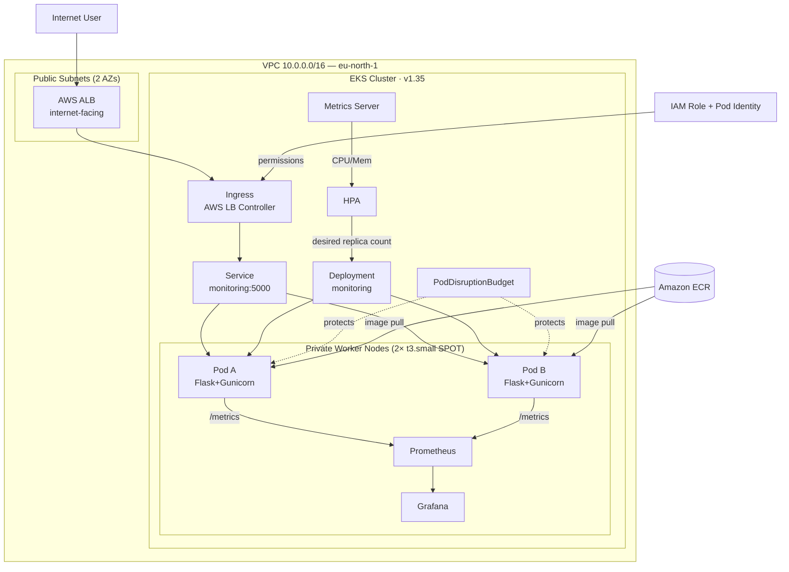

Four focused diagrams cover the major flows in depth: [traffic](#traffic-flow--alb--ingress--service--pod), [observability](#observability), [autoscaling](#autoscaling), and [failure recovery](#failure-injection-diagnosis--recovery).

### Local vs. AWS environment

The project was built in two phases so Kubernetes fundamentals could be learned and broken cheaply before spending AWS budget.

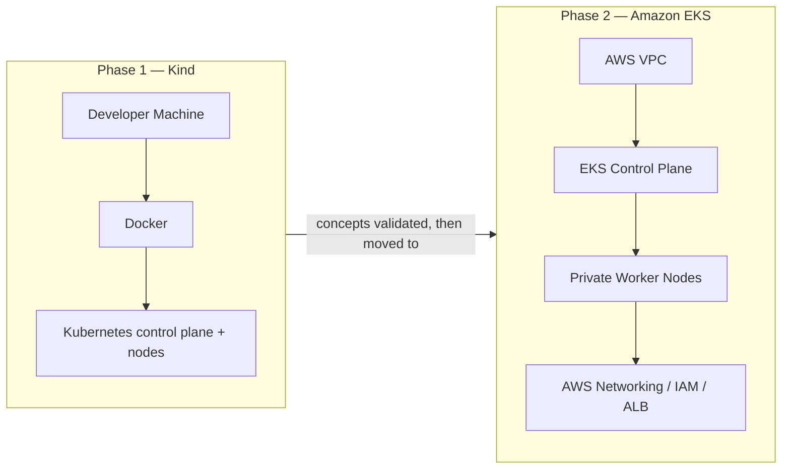

Kubernetes concepts stayed the same between phases; what changed was everything **around** Kubernetes — AWS networking, IAM, load balancing, and cloud observability.

---

## Technology Stack

| Category | Technology | Purpose |
|---|---|---|
| Cloud | Amazon Web Services (AWS) | Cloud infrastructure and managed Kubernetes |
| Kubernetes | Amazon EKS | Production-context Kubernetes environment |
| Local Kubernetes | Kind | Local Kubernetes learning and validation |
| Infrastructure as Code | Terraform | VPC and EKS infrastructure provisioning |
| Containerization | Docker | Application containerization |
| Container Registry | Amazon ECR | Private container image storage |
| Application | Python / Flask | Cloud-native monitoring application |
| Application Server | Gunicorn | Production WSGI server |
| Application Metrics | Prometheus Client | Exposing application metrics |
| System Metrics | psutil | CPU and memory collection |
| Load Balancing | AWS Application Load Balancer | External HTTP traffic |
| Ingress | Kubernetes Ingress | Application routing |
| AWS Integration | AWS Load Balancer Controller | Creates and manages AWS load balancers |
| AWS Identity | EKS Pod Identity | IAM permissions for Kubernetes workloads |
| Monitoring | Prometheus | Metrics collection and time-series monitoring |
| Visualization | Grafana | Metrics visualization and dashboards |
| Kubernetes Metrics | Metrics Server | Resource metrics for Kubernetes/HPA |
| Autoscaling | Horizontal Pod Autoscaler | Dynamic workload scaling |
| Security | Kubernetes RBAC | API authorization |
| Security | Kubernetes NetworkPolicy | Pod network traffic control |
| Availability | PodDisruptionBudget | Availability protection during voluntary disruptions |
| Package Management | Helm | Kubernetes application installation and management |
| Source / Registry Workflow | GitHub + Amazon ECR | Source control and container image workflow |

---

## Infrastructure (AWS + Terraform)

Terraform provisions everything the EKS environment needs:

- VPC (`10.0.0.0/16`)
- Public subnets (for internet-facing load balancing)
- Private worker subnet
- Dedicated control-plane subnet
- Route tables, Internet Gateway, NAT Gateway, Elastic IP
- EKS cluster + managed node group

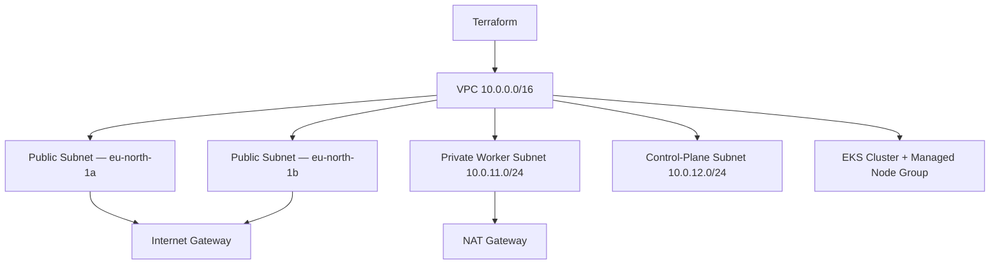

**Why this split exists:** worker nodes stay in a private subnet with outbound-only NAT connectivity, so they are never directly exposed to the internet. Public subnets exist purely so AWS load-balancer infrastructure can be internet-facing. This produces a clean separation:

```
Public infrastructure  → internet-facing load balancing
Private infrastructure → EKS worker nodes → application Pods
```

### AWS network architecture (as built)

| Component | Value |
|---|---|
| VPC CIDR | `10.0.0.0/16` |
| Private worker subnet | `10.0.11.0/24`, NAT Gateway for egress |
| Control-plane subnet | `10.0.12.0/24` (not used for load-balancer discovery) |
| Public subnets | `eu-north-1a` and `eu-north-1b`, tagged `kubernetes.io/role/elb=1` |
| EKS cluster | `cloud-native-monitoring-eks`, Kubernetes `v1.35` |
| Worker nodes | 2× `t3.small` SPOT instances (`10.0.11.234`, `10.0.11.85`) |

A second public subnet in a different Availability Zone was required specifically because **an internet-facing AWS load balancer needs public subnets in multiple AZs** — a practical lesson learned while wiring up the ALB.

**Evidence — the two EKS worker nodes, Ready:**

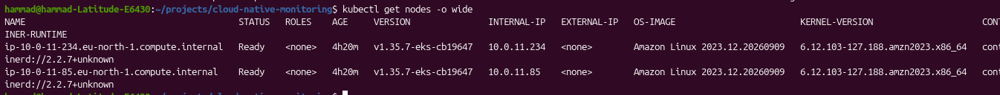

---

## Local Development — Kind

**Why Kind?** It provides a real Kubernetes control plane and worker-node experience while running entirely in local Docker. The goal wasn't just avoiding AWS cost — it was being able to break things quickly and repeatedly without waiting on cloud infrastructure.

Concepts validated locally before ever touching AWS:

Deployments · ReplicaSets · Pods · Services · Labels/selectors · ConfigMaps · Secrets · resource requests/limits · startup/readiness/liveness probes · rolling updates · rollbacks · HPA · ServiceAccounts · RBAC · NetworkPolicies · log/exec-based debugging · scheduling behavior · graceful shutdown · reconciliation.

The core mental model developed here — and reused throughout the AWS phase — is Kubernetes reconciliation:

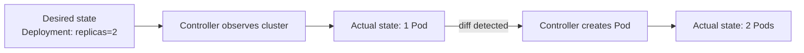

This same loop reappeared throughout the deliberate failure labs (below).

Local configuration lives in `kind-multinode.yaml` at the repo root.

---

## Application & Containerization

### Application (`app.py`)

A lightweight Flask app built to be a *realistic* workload, not a "hello world" container. It exposes three endpoints:

| Endpoint | Purpose |
|---|---|
| `/` | Browser dashboard: CPU %, memory %, Pod hostname, high-resource warning. The hostname is shown deliberately so traffic can be observed moving between replicas. |
| `/healthz` | `GET /healthz → {"status": "ok"}`. Deliberately minimal so health checks test *availability*, not dashboard rendering. |
| `/metrics` | Prometheus exposition format via the Prometheus Python client: `monitoring_cpu_usage_percent`, `monitoring_memory_usage_percent`. |

The application also includes an intentional 20-second startup delay (`time.sleep(20)`) used to exercise Kubernetes startup-probe behavior (see [Failure Injection](#failure-injection-diagnosis--recovery)), and SIGTERM handling for graceful shutdown.

### Containerization (`Dockerfile`)

```dockerfile
FROM python:3.11-slim-bookworm
WORKDIR /app
COPY requirements-runtime.txt .
RUN pip install --no-cache-dir -r requirements-runtime.txt
COPY . .
RUN useradd --create-home --shell /usr/sbin/nologin appuser && chown -R appuser:appuser /app
USER appuser
ENV FLASK_RUN_HOST=0.0.0.0 \
    PORT=5000
EXPOSE 5000
HEALTHCHECK --interval=30s --timeout=5s --start-period=15s --retries=3 \
  CMD python -c "import os, urllib.request; urllib.request.urlopen('http://127.0.0.1:%s/healthz' % os.environ.get('PORT', '5000'), timeout=3).read()" || exit 1
CMD ["gunicorn", "--bind", "0.0.0.0:5000", "app:app"]
```

Key choices:

- **Gunicorn**, not Flask's dev server, as the WSGI server.
- **Non-root runtime** — a dedicated `appuser`, verified in a running Pod with `whoami` → `appuser`.
- **Docker-level `HEALTHCHECK`** against `/healthz`, independent of Kubernetes.
- **`.dockerignore`** excludes Git metadata, Terraform state, Kubernetes manifests, env files, virtualenvs, caches, tests, IDE files, docs, logs, temp files, and local AWS state — keeping the build context focused on runtime needs only.

### Amazon ECR

```
574921529429.dkr.ecr.eu-north-1.amazonaws.com/my_monitoring_app_image
```

Image flow: `Docker build → local image → Amazon ECR → EKS Deployment → Pods`. Versioned tags (e.g. `v11`) were used deliberately instead of `latest` — this mattered directly during the [stale-image Prometheus incident](#1-prometheus-target-was-down) below.

---

## Kubernetes Deployment

The workload runs in a dedicated `monitoring` namespace (isolated from `kube-system`), with the following resources:

```
Application
├── Deployment (replicas: 2)
├── Service (ClusterIP, port 5000)
├── ConfigMap
├── Secret
├── ServiceAccount
├── RBAC Role + RoleBinding
├── NetworkPolicy
├── HPA
├── PodDisruptionBudget
├── ServiceMonitor
└── Ingress (ALB)
```

- **Replicas: 2**, spread across the two EKS worker nodes — enough to exercise rolling updates, Pod failure, HPA scaling, node drain, and PDB behavior.
- **Resource requests/limits** (final configuration): CPU request `50m` / limit `200m`; memory request `64Mi` / limit `128Mi`. These were intentionally tested, not left as arbitrary defaults — see the [OOMKilled lab](#oomkilled-failure-lab).
- **Configuration and Secrets** are kept out of the container image, following the principle of separating `application image + runtime config + sensitive config`. A Secret was deliberately removed during a lab to observe `FailedMount` behavior (below).
- **Kubernetes Service** selects Pods via labels and provides a stable internal endpoint (`monitoring:5000`) even as Pod IPs change.

Helm was used to install the heavier platform components rather than hand-writing every manifest: **AWS Load Balancer Controller**, **Metrics Server**, and the **kube-prometheus-stack** (Prometheus, Grafana, Alertmanager, Prometheus Operator, kube-state-metrics, node-exporter).

**Evidence — the full `monitoring` namespace running on EKS** (application Pods, Prometheus, Grafana, Alertmanager, Prometheus Operator, kube-state-metrics, node-exporter, all `Running` and spread across both worker nodes):

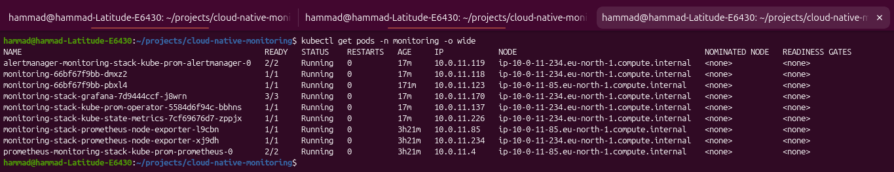

### Configuration philosophy

```
Terraform              → AWS infrastructure
Helm                   → platform components
Kubernetes manifests   → application workloads and policies
Docker                 → application packaging
Prometheus / Grafana   → observability
```

Each layer owns one concern, which made the system easier to debug when something broke.

---

## Traffic Flow — ALB → Ingress → Service → Pod

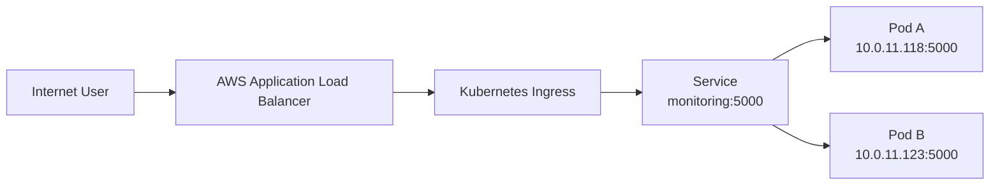

The **AWS Load Balancer Controller** watches the `Ingress` object and provisions the actual ALB — Kubernetes' declarative model extended into AWS:

```
Ingress resource → AWS Load Balancer Controller → AWS API → Application Load Balancer
```

Key Ingress annotations:

```yaml
apiVersion: networking.k8s.io/v1
kind: Ingress
metadata:
  name: monitoring
  namespace: monitoring
  annotations:
    alb.ingress.kubernetes.io/scheme: internet-facing
    alb.ingress.kubernetes.io/target-type: ip
spec:
  ingressClassName: alb
  rules:
    - http:
        paths:
          - path: /
            pathType: Prefix
            backend:
              service:
                name: monitoring
                port:
                  number: 5000
```

- `scheme: internet-facing` — reachable from the public internet.
- `target-type: ip` — the ALB targets **Pod IPs directly**, not the EC2 node/NodePort, giving `ALB → Pod IP → container:5000` instead of `ALB → Node → NodePort → Pod`.

The controller was installed via Helm:

```bash
helm upgrade --install aws-load-balancer-controller \
  eks/aws-load-balancer-controller \
  --version 3.5.0 \
  -n kube-system \
  --set clusterName=cloud-native-monitoring-eks \
  --set serviceAccount.create=false \
  --set serviceAccount.name=aws-load-balancer-controller \
  --set region=eu-north-1 \
  --set vpcId=vpc-09af8dfafcae2b6f3
```

verified healthy with two running replicas. The ALB target group used `Protocol: HTTP, Port: 5000, Target: IP`; both Pods registered as healthy targets (ALB health check on `/`, Kubernetes/app-level checks on `/healthz`). The final ALB DNS name had the shape:

```
k8s-monitori-monitori-<identifier>.eu-north-1.elb.amazonaws.com
```

**Evidence — the dashboard served live through the ALB DNS name**, showing host CPU/memory and the responding Pod's hostname (useful for confirming which replica handled the request):

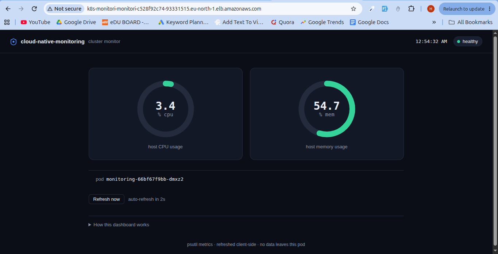

### IAM and EKS Pod Identity

The controller needs AWS API access without static credentials in the Pod:

```
IAM Policy (WHAT it can do) → IAM Role (WHO gets it) → EKS Pod Identity (WHICH workload) → ServiceAccount → Controller
```

- **Policy:** `AWSLoadBalancerControllerIAMPolicy`
- **Role:** `AmazonEKSLoadBalancerControllerRole`, trusted by the EKS Pod Identity service principal:

```json
{
  "Version": "2012-10-17",
  "Statement": [
    {
      "Effect": "Allow",
      "Principal": { "Service": "pods.eks.amazonaws.com" },
      "Action": ["sts:AssumeRole", "sts:TagSession"]
    }
  ]
}
```

- **Association:** cluster `cloud-native-monitoring-eks`, namespace `kube-system`, ServiceAccount `aws-load-balancer-controller`. No static AWS access key ever lived inside the controller Pod.

### Debugging the load-balancer layer

Rather than immediately editing YAML, the working checklist was:

```
1. Does the ALB exist?              6. Does the Service have endpoints?
2. Is the listener configured?      7. Are Pods Ready?
3. Are targets registered?          8. Is the app listening on 5000?
4. Are targets healthy?             9. Does /healthz respond?
5. Does the Ingress exist?
```

**Key DevOps lesson:** an Ingress is not "just another YAML file" — it's a dependency chain (`Ingress → Controller → IAM → AWS API → ALB → subnets/networking → target registration → Pod reachability`), and a failure anywhere in that chain makes the app look unreachable. Follow the request path layer by layer instead of guessing at the manifest.

---

## Observability

Two independent pipelines answer two different questions:

| Pipeline | Question it answers |
|---|---|
| Prometheus → Grafana | *What is happening in the system?* (human observability) |
| Metrics Server → HPA | *Should Kubernetes change replica count?* (automated control loop) |

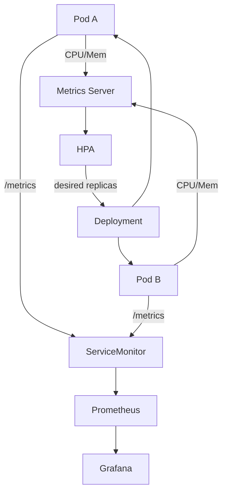

### Prometheus

Deployed via the `kube-prometheus-stack` Helm chart (`kube-prometheus-stack: 91.4.1`, Prometheus Operator `v0.94.0`):

```bash
helm upgrade monitoring-stack \
  prometheus-community/kube-prometheus-stack \
  -n monitoring \
  -f k8s/prometheus-values.yaml
```

### ServiceMonitor

Instead of hand-configuring scrape targets, a Prometheus Operator `ServiceMonitor` selects the app by label:

```yaml
apiVersion: monitoring.coreos.com/v1
kind: ServiceMonitor
metadata:
  name: monitoring
  namespace: monitoring
  labels:
    release: monitoring-stack
spec:
  selector:
    matchLabels:
      app: monitoring-app
  endpoints:
    - port: http
      path: /metrics
      interval: 15s
```

This is where two of the project's most useful debugging incidents happened — see [Prometheus discovery failure](#2-servicemonitor-discovery-failure) and [the stale-image incident](#1-prometheus-target-was-down) below.

**Evidence — Prometheus Target health page**, showing the `serviceMonitor/monitoring/monitoring/0` target group at `2/2 up`, both application Pods scraped successfully on `/metrics`:

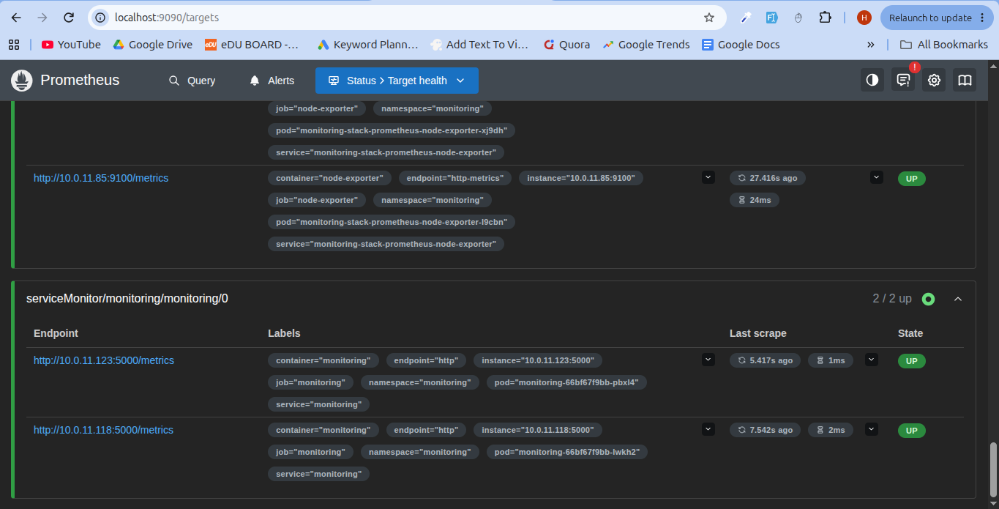

**Evidence — PromQL validation** of the two custom application metrics, queried per-Pod:

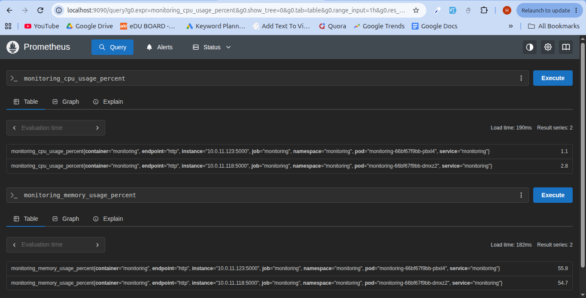

### Grafana

Accessed via port-forward:

```bash
kubectl port-forward -n monitoring svc/monitoring-stack-grafana 3000:80
```

and used to visualize CPU, memory, and Pod-level application metrics — see the [Grafana resource incident](#3-grafana-resource-failure).

**Evidence — the custom Grafana dashboard**, showing per-Pod CPU and memory usage over time (the visible spike corresponds to a deliberate load test):

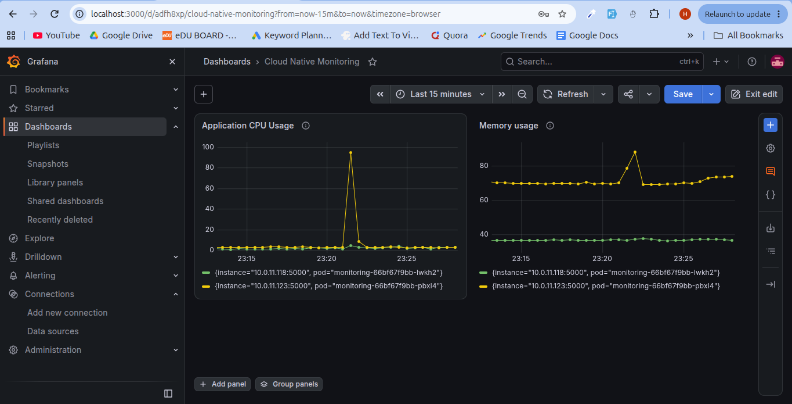

### Metrics Server vs. Prometheus

| Component | Purpose |
|---|---|
| Prometheus | Monitoring and time-series collection |
| Grafana | Visualization |
| Metrics Server | Lightweight resource metrics for Kubernetes |
| HPA | Uses Metrics Server data to adjust replica count |

Installed via Helm (`metrics-server: 3.14.0`), validated with `kubectl top nodes` / `kubectl top pods -n monitoring`. These two systems are not interchangeable — Prometheus/Grafana never feed the HPA in this setup; Metrics Server does.

---

## Autoscaling

```
Minimum replicas: 2      Maximum replicas: 5      CPU target: 50%
```

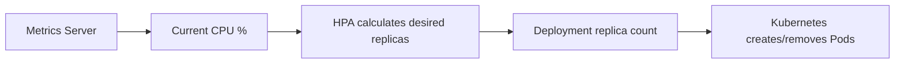

HPA never creates Pods directly — it changes the Deployment's desired replica count, and the Deployment/ReplicaSet reconcile the rest.

**Scale-up test:** a load generator drove CPU pressure; replicas progressed `2 → 4 → 5` and respected the configured maximum.

**Scale-down test:** after load stopped, replicas stepped back down `5 → 3 → 2`, returning to the configured minimum — validating both directions of HPA behavior, not just scale-up.

**Evidence — live HPA scale-up under load**, generated with a `busybox` load generator hammering the Service:

```bash
kubectl run load-generator -n monitoring --image=busybox:1.36 --restart=Never \
  -- sh -c 'while true; do wget -q -O- http://monitoring:5000/ >/dev/null; done'
```

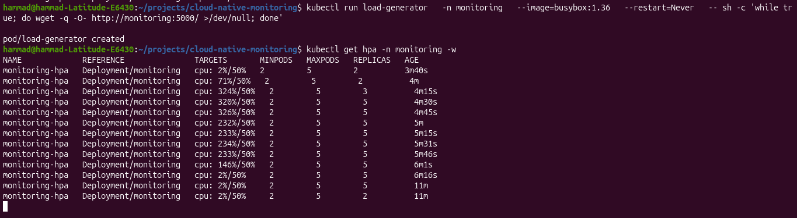

CPU utilization spiked as high as `326%` against the `50%` target, and the HPA scaled replicas `2 → 3 → 5`, holding at the configured maximum for as long as load continued, then scaling back down to `2` once the load generator's traffic stopped.

---

## Security

Three independent layers were built **and actively tested**, not just configured:

```
Identity          → ServiceAccount
Authorization     → RBAC (what can this identity do against the K8s API?)
Network isolation → NetworkPolicy (which Pod-to-Pod traffic is allowed?)
AWS permissions   → EKS Pod Identity + IAM
Container runtime → non-root user
```

### RBAC

A Role granting read-only access:

```
Pods:     get, list, watch
Services: get, list, watch
```

connected to the workload's ServiceAccount via a RoleBinding. This was validated, not assumed:

```
GET Pods    → 200 OK          (permitted)
DELETE Pod  → 403 Forbidden   (denied)
```

Authentication (ServiceAccount identity) and authorization (what it can do) are different things, and only testing both proves the config is correct.

### NetworkPolicy

A policy restricts traffic to the monitoring app to an explicitly labeled source. The important discovery: **the policy object existing is not the same as the policy being enforced.** The EKS VPC CNI initially had `--enable-network-policy=false`, so the NetworkPolicy had zero practical effect despite being applied successfully. After enabling enforcement, behavior became correct: a source labeled `access=monitoring` was allowed; an unlabeled source was denied.

### RBAC vs. NetworkPolicy

| Mechanism | Controls | Example |
|---|---|---|
| ServiceAccount | Workload identity | Which identity does the Pod use? |
| RBAC | Kubernetes API authorization | Can it list Pods? |
| NetworkPolicy | Network connectivity | Can this Pod talk to that Pod? |

A workload can simultaneously have RBAC permission *and* a network restriction — these are independent boundaries.

### Security failure labs

- **Missing ServiceAccount** — deliberately removed; the Pod could not fully establish its resources → workload failure. Restored, workload recovered.
- **Missing Secret** — deliberately removed → Pod reported `FailedMount`. Reinforces: a Pod is the sum of multiple resources (ConfigMap, Secret, ServiceAccount, volumes, probes, image, resources) — inspect all of them, not just app logs.

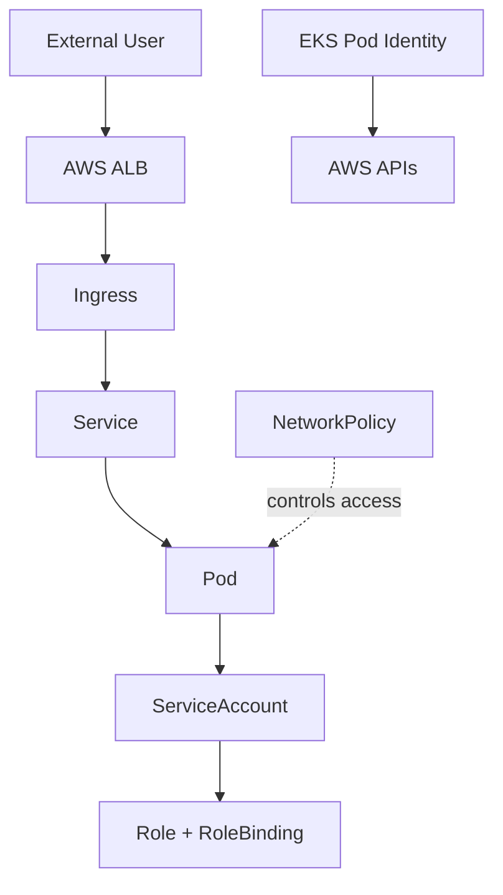

No single mechanism covers everything — each protects a different boundary.

---

## Reliability & High Availability

- **2 replicas**, distributed across both worker nodes.
- **Health probes** distinguish startup, readiness, and liveness (see below).
- **Resource requests/limits** tuned and stress-tested (OOM lab).
- **PodDisruptionBudget** protects a minimum available replica count during voluntary disruption.
- **Rolling updates + rollback** validated via a deliberate bad-image rollout.
- **Graceful shutdown** via SIGTERM handling.

---

## Failure Injection, Diagnosis & Recovery

This is the project's differentiator: every mechanism above was validated by **breaking it on purpose**, observing the failure, diagnosing the layer at fault, and recovering — the same repeatable loop each time:

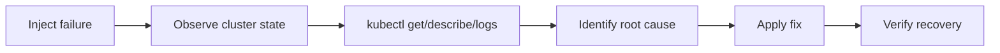

### Health probe labs

- **Startup probe:** the app's intentional 20s startup delay initially failed the probe; after startup completed, the probe succeeded and the Pod became healthy — demonstrating why slow-starting apps need a `startupProbe` rather than being treated as failed outright.
- **Readiness probe:** the readiness path was deliberately pointed at an invalid `/healthz-broken`. The Pod stayed `Running` but became `NotReady` — proving *running* and *ready* are different states. Restoring `/healthz` fixed it.

### Service selector failure lab

The Service selector was deliberately mismatched from the Pod labels. The Service object still existed, but its EndpointSlice went empty — `Client → Service → no matching endpoints → no response`. Lesson: **a Service discovers Pods through label matching, not by application name.**

### ImagePullBackOff lab

A rollout used a nonexistent tag (`v999`); new Pods entered `ImagePullBackOff` while existing healthy Pods stayed available. Recovered with:

```bash
kubectl rollout undo deployment/monitoring -n monitoring
```

### OOMKilled failure lab

The memory limit was deliberately dropped too low. The container was killed with `OOMKilled` / exit code `137`, and the Pod entered `CrashLoopBackOff`. Diagnosed with `kubectl describe pod`, `kubectl logs`, `kubectl logs --previous`. Resource limits were restored and the workload recovered — a concrete demonstration of the difference between an application crash and a container killed for exceeding its memory limit.

### Container runtime debugging lab

The healthy Deployment was saved first (`kubectl get deployment monitoring -n monitoring -o yaml > /tmp/monitoring-before-debug-lab.yaml`), then the container was made to exit non-zero on purpose, producing `CrashLoopBackOff`. `kubectl logs --previous` surfaced the deliberate command failure — underscoring why *previous*-container logs matter after a restart. A `kubectl exec` session (`whoami`, `pwd`, `env`) confirmed the runtime ran as `appuser` from `/app`, and also revealed the slim image lacks tools like `ps` — a reminder that minimal images trade debugging convenience for a smaller attack surface; the right response is better use of logs/events/`describe`, not bloating the production image.

### Gunicorn read-only filesystem issue

Running as non-root exposed a real runtime assumption: Gunicorn tried to write to a location the restricted filesystem didn't allow. Fixed with a writable `emptyDir` mount for Gunicorn's runtime directory — proof that a container can be secure from a privilege standpoint while still failing if the process assumes writable paths that aren't there.

### Graceful shutdown validation

SIGTERM handling was confirmed in logs (`Handling signal: term` → `Received SIGTERM - beginning graceful shutdown...`), and the replaced Pod came back healthy — validating expected behavior during deletions, rolling updates, and node drains.

### Scheduling failure lab

A Pod was given a scheduling constraint against a node label that didn't exist → Pod went `Pending` (scheduler: no matching node). Labeling a node correctly resolved it — a direct demonstration of `constraint → scheduler evaluates nodes → match/no-match`.

### Prometheus / Grafana / HPA incidents — see the numbered write-ups below.

### Node drain + PodDisruptionBudget incident (the deepest lab)

1. Node `ip-10-0-11-234...` was cordoned, then drained (`--ignore-daemonsets --delete-emptydir-data`); DaemonSets (`aws-node`, `kube-proxy`, `eks-pod-identity-agent`, `node-exporter`) were correctly ignored.
2. The monitoring Pod was evicted. PDB state became `Current: 1, Desired: 1, Allowed disruptions: 0` — the PDB had hit its floor.
3. The replacement Pod went `Pending`: `0/2 nodes are available: 1 Too many pods, 1 node(s) were unschedulable`.
4. **Root cause:** not CPU or memory — the remaining node had hit its **Pod-count capacity** (~11 non-terminated Pods), and the other node was cordoned. `Preemption is not helpful for scheduling` confirmed it wasn't a priority issue either.
5. **Recovery:** `kubectl uncordon ip-10-0-11-234...` → the replacement Pod scheduled and became `Running`/`Ready`; PDB returned to `Current: 2, Desired: 1, Allowed disruptions: 1`.

**Key lesson:** a PodDisruptionBudget protects availability during voluntary disruption — it does **not** create capacity. Kubernetes still needs a schedulable node with room before it can recreate a workload.

### Deliberate failure lab summary

| Failure | Observed behavior | Recovery |
|---|---|---|
| Missing ServiceAccount | Workload failure | Restore ServiceAccount |
| Missing Secret | `FailedMount` | Restore Secret |
| Slow startup | Startup probe failures | Allow startup period |
| Broken readiness path | Pod `NotReady` | Restore `/healthz` |
| Broken Service selector | Empty endpoints | Restore selector |
| OOM limit | `OOMKilled`, exit 137 | Restore memory limit |
| Invalid image | `ImagePullBackOff` | Roll back Deployment |
| Missing Metrics Server | HPA metrics unavailable | Install Metrics Server |
| Broken RBAC permission | `403 Forbidden` | Validate correct Role |
| NetworkPolicy disabled | Policy ineffective | Enable enforcement |
| NetworkPolicy denial | Traffic blocked | Correct source label |
| Debug command failure | `CrashLoopBackOff` | Restore Deployment |
| Gunicorn filesystem issue | Container startup issue | Add writable runtime volume |
| Scheduling constraint | Pod `Pending` | Provide matching node |
| Prometheus stale image | Target scrape failure | Build/push correct image |
| Grafana memory pressure | Restarts / exit 137 | Increase resources |
| Node drain | Replacement Pod `Pending` | Restore schedulable capacity |

### Major debugging write-ups (Symptom → Investigation → Root Cause → Fix → Lesson)

#### 1. Prometheus Target Was Down
- **Symptom:** target unhealthy; error `received unsupported Content-Type "application/json"`.
- **Investigation:** `/metrics` was tested directly and found to return JSON, not Prometheus exposition text; the running image was found to be an older artifact.
- **Root cause:** stale ECR image running an old `/metrics` implementation.
- **Fix:** built and pushed `my_monitoring_app_image:v11`, updated the Deployment; `/metrics` then returned `text/plain; version=1.0.0; charset=utf-8`; Prometheus reported `2/2 UP`.
- **Lesson:** when monitoring reports an application-level error, verify the actual running workload before touching the monitoring config.

#### 2. ServiceMonitor Discovery Failure
- **Symptom:** Prometheus didn't discover the intended ServiceMonitor.
- **Investigation:** label mismatch — ServiceMonitor used `release: monitoring`, Prometheus expected `release: monitoring-stack`.
- **Fix:** corrected the label; discovery succeeded.
- **Lesson:** observability depends on the same Kubernetes primitives as application workloads — one wrong label breaks the whole discovery chain.

#### 3. Grafana Resource Failure
- **Symptom:** repeated restarts, exit code `137` (memory exhaustion).
- **Investigation:** `kubectl top pods -n monitoring` showed the initial memory allocation was too restrictive.
- **Fix:** raised resources to `requests: cpu 100m / memory 128Mi`, `limits: cpu 300m / memory 512Mi`; Grafana reached `3/3 Running, 0 restarts`.
- **Lesson:** monitoring infrastructure is production infrastructure — it needs resource planning too.

#### 4. PDB + Node Drain Scheduling Incident
- Fully detailed above under [Node drain + PDB incident](#node-drain--poddisruptionbudget-incident-the-deepest-lab).
- **Lesson:** a PDB protects availability; it does not create capacity.

#### 5. NetworkPolicy Initially Had No Effect
- **Symptom:** traffic wasn't restricted despite an applied NetworkPolicy.
- **Root cause:** EKS VPC CNI had `--enable-network-policy=false`.
- **Fix:** enabled enforcement; re-tested — unlabeled sources denied, `access=monitoring` sources allowed.
- **Lesson:** a declarative security object existing doesn't guarantee enforcement — the dataplane has to actually implement it.

#### 6. HPA Metrics Were Initially Unavailable
- **Root cause:** Metrics Server was missing after the EKS environment was recreated.
- **Fix:** installed via Helm; `kubectl top nodes` / `kubectl top pods` returned data; HPA could then scale.
- **Lesson:** when an autoscaler can't decide, check the metrics pipeline before touching the Deployment.

---

## Troubleshooting Method

The repeatable process used across every lab above:

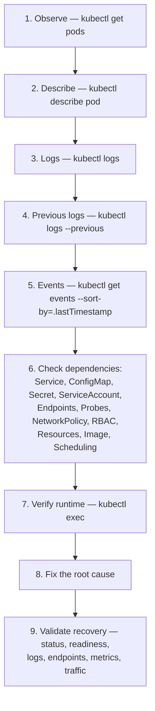

---

## Node Operations — Cordon & Drain

```bash
# Prevent new scheduling on a node
kubectl cordon ip-10-0-11-234.eu-north-1.compute.internal

# Evict eligible workloads (DaemonSets ignored)
kubectl drain ip-10-0-11-234.eu-north-1.compute.internal \
  --ignore-daemonsets \
  --delete-emptydir-data

# Return the node to service
kubectl uncordon ip-10-0-11-234.eu-north-1.compute.internal
```

DaemonSet-managed components (`aws-node`, `kube-proxy`, `eks-pod-identity-agent`, `node-exporter`) are correctly left in place during a drain. See the [node drain + PDB incident](#node-drain--poddisruptionbudget-incident-the-deepest-lab) for the full scheduling story this exercise uncovered.

---

## Deployment Lifecycle

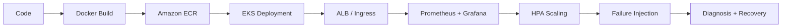

`Infrastructure → Container → Kubernetes → AWS Load Balancer → Application → Metrics → Prometheus → Grafana → Autoscaling → Failure → Diagnosis → Recovery`

---

## Repository Structure

The repository separates **application**, **Kubernetes**, and **infrastructure** concerns. Per the current top-level file listing:

```
cloud-native-monitoring/
│
├── app.py                     # Flask application (/, /healthz, /metrics)
├── ecr.py                     # ECR-related helper script
├── eks.py                     # EKS-related helper script
├── Dockerfile
├── .dockerignore
├── .gitpod.yml
├── Makefile                   # test / lint / docker-build targets
├── requirements-runtime.txt   # app runtime dependencies
├── requirements-devops.txt    # tooling/dev dependencies
├── configmap.yaml             # application ConfigMap
├── iam_policy.json            # AWS Load Balancer Controller IAM policy
├── pod_identity_trust.json    # EKS Pod Identity trust relationship
├── project.yaml
├── kind-multinode.yaml        # local Kind cluster topology
├── index.html                 # (also under templates/)
│
├── templates/
│   └── index.html             # dashboard template rendered by Flask
│
├── k8s/                       # Kubernetes manifests (Deployment, Service, Ingress,
│                               # ServiceAccount, Role/RoleBinding, NetworkPolicy,
│                               # HPA, PDB, ServiceMonitor, prometheus-values.yaml)
│
├── terraform/                 # VPC, subnets, EKS cluster, node group
│
├── tests/                     # unit tests run via `make test`
│
└── README.md
```

> As flagged at the top of this document, `configmap.yaml` currently sits at the repository root rather than inside `k8s/` as originally documented — worth reconciling so the manifest layout matches the intended `application / Kubernetes / infrastructure` separation. `ecr.py` and `eks.py` are present at the root but are not otherwise described in the original documentation; if they automate ECR/EKS setup steps referenced above, documenting their exact role (versus the manual/Helm steps described here) would close that gap.

---

## Commands / Quick Start

### Prerequisites

- Docker
- `kubectl`
- Kind (local) or an AWS account with permissions for VPC/EKS/IAM/ECR (cloud)
- Terraform
- Helm
- Python 3.11

### Local — lint, test, build

```bash
make help          # Targets: test lint docker-build
make lint          # py_compile app.py ecr.py eks.py
make test          # python3 -m unittest discover -s tests
make docker-build  # docker build -t cloud-native-monitoring:local .
```

### Local Kubernetes with Kind

```bash
kind create cluster --config kind-multinode.yaml
kubectl apply -f k8s/
```

### AWS infrastructure with Terraform

```bash
cd terraform
terraform init
terraform plan
terraform apply
```

### Platform components via Helm

```bash
# AWS Load Balancer Controller
helm upgrade --install aws-load-balancer-controller \
  eks/aws-load-balancer-controller \
  --version 3.5.0 -n kube-system \
  --set clusterName=cloud-native-monitoring-eks \
  --set serviceAccount.create=false \
  --set serviceAccount.name=aws-load-balancer-controller \
  --set region=eu-north-1 \
  --set vpcId=<your-vpc-id>

# Metrics Server
helm upgrade --install metrics-server metrics-server/metrics-server -n kube-system

# kube-prometheus-stack (Prometheus + Grafana + Alertmanager)
helm upgrade monitoring-stack prometheus-community/kube-prometheus-stack \
  -n monitoring -f k8s/prometheus-values.yaml
```

### Deploy the application to EKS

```bash
kubectl apply -f k8s/
kubectl get pods -n monitoring
kubectl get ingress -n monitoring
```

### Observe and scale

```bash
kubectl port-forward -n monitoring svc/monitoring-stack-grafana 3000:80
kubectl top nodes
kubectl top pods -n monitoring
kubectl get hpa -n monitoring
```

### Testing failure/recovery

```bash
kubectl rollout undo deployment/monitoring -n monitoring
kubectl describe pod <pod> -n monitoring
kubectl logs <pod> -n monitoring --previous
kubectl get events -n monitoring --sort-by=.lastTimestamp
```

---

## Engineering Decisions

| Decision | Why |
|---|---|
| **Kind before EKS** | Learn and break Kubernetes fundamentals cheaply and quickly, without AWS cost or latency, before validating on real cloud infrastructure. |
| **Amazon EKS** | Validate the same concepts against a managed, production-context Kubernetes control plane and real AWS networking/IAM. |
| **Terraform** | Reproducible, declarative provisioning of VPC/subnets/EKS rather than manual console clicks. |
| **Private worker nodes** | Worker nodes never need direct internet exposure; NAT provides outbound-only connectivity, reducing attack surface. |
| **AWS ALB via Ingress + target-type: ip** | Routes directly to Pod IPs (bypassing NodePort hops) and integrates natively with AWS's internet-facing load balancing. |
| **EKS Pod Identity over static credentials** | Removes static AWS access keys from Pods entirely; permissions are scoped and short-lived via IAM role assumption. |
| **Prometheus + Grafana** | Industry-standard, Kubernetes-native metrics collection and visualization, installable and manageable via Helm at scale. |
| **Metrics Server + HPA** | Minimal, purpose-built resource-metrics pipeline for autoscaling, decoupled from the heavier Prometheus stack. |
| **PodDisruptionBudget** | Protects a minimum available replica count specifically during *voluntary* disruptions (node drains, rolling updates). |
| **NetworkPolicy** | Enforces which Pods can talk to which — a boundary RBAC does not cover. |
| **Explicit resource requests/limits** | Makes scheduling and autoscaling decisions predictable, and turns resource exhaustion into an observable, debuggable event (`OOMKilled`) rather than silent degradation. |
| **Non-root container user** | Reduces blast radius if the application process is compromised. |
| **Helm for platform components** | Manages relatively large third-party stacks (kube-prometheus-stack, AWS LB Controller, Metrics Server) without hand-authoring every resource. |

---

## Production Considerations

Project scope intentionally stopped once the learning objectives were validated. A production build-out would extend it:

| Area | Next steps |
|---|---|
| **High Availability** | Multi-AZ worker capacity, node headroom, managed/autoscaling node groups, workload topology constraints, cluster autoscaling, capacity planning. |
| **EKS endpoint security** | Restrict public API access; consider private endpoint access, VPN, or a bastion/access host. |
| **Secrets management** | Move from raw Kubernetes Secrets to AWS Secrets Manager, SSM Parameter Store, or external-secrets tooling. |
| **Container security** | Read-only root filesystem, dropped Linux capabilities, seccomp, `SecurityContext` hardening, image signing/scanning, dependency scanning, admission control. |
| **Observability** | Alerting rules, Alertmanager routing, persistent Prometheus storage, centralized logs, distributed tracing, SLO/SLI definitions, dashboard ownership, incident response. |
| **Autoscaling** | Pair HPA with Cluster Autoscaler / Karpenter so Pod scale-up always has somewhere to land, plus cost controls. |
| **Network architecture** | Tighter security groups, VPC endpoints, private AWS service connectivity, subnet sizing, network segmentation. |
| **Infrastructure** | Reusable Terraform modules, multiple environments, remote state, CI/CD. |
| **Kubernetes** | GitOps, policy enforcement, advanced scheduling, cluster autoscaling. |
| **Reliability** | Multi-AZ capacity, disaster recovery, backup strategy. |

---

## Cleanup

Because this environment runs real AWS resources, cleanup matters:

```bash
kubectl get nodes
kubectl get pods -A
kubectl get ingress -A

# Remove Helm-managed components and application workloads first, then:
cd terraform
terraform destroy
```

After destruction, confirm no billable resources remain: EC2 instances, NAT Gateway, Elastic IPs, Load Balancers, the EKS cluster, and ECR repositories/images.

---

## Skills Demonstrated

| Area | Demonstrated Skills |
|---|---|
| Cloud | AWS, EKS, VPC, ECR, IAM |
| Kubernetes | Deployments, Services, Ingress, HPA, RBAC, NetworkPolicy, PDB, probes |
| Infrastructure as Code | Terraform (VPC, subnets, EKS, node groups) |
| Containers | Docker, non-root runtime, image versioning |
| Observability | Prometheus, ServiceMonitor, Grafana, Metrics Server |
| Security | IAM least privilege, EKS Pod Identity, RBAC, NetworkPolicy enforcement |
| Reliability | PodDisruptionBudget, health probes, rolling updates/rollback, graceful shutdown |
| Operations | 17-scenario failure injection and recovery, node cordon/drain, layered troubleshooting method |

---

## Key Lessons

1. **Kubernetes is a reconciliation system** — desired state → controller → actual state → diff → reconciliation, repeated everywhere from Deployments to HPA.
2. **Debug the layer that's actually failing** — container, image, probe, Service, Ingress, ALB, IAM, NetworkPolicy, RBAC, scheduler, node capacity, or metrics pipeline; the failure isn't always application code.
3. **Kubernetes events are as valuable as application logs** — use both together.
4. **Running ≠ Healthy** — a Pod can be `Running` and `NotReady` at the same time.
5. **Labels are infrastructure** — they drive Service selectors, ServiceMonitor discovery, NetworkPolicy scope, PDB selection, and scheduling. A wrong label breaks a healthy system.
6. **Monitoring must be debugged like an application** — the full chain (`app → endpoint → Service → ServiceMonitor → Prometheus discovery → scrape → metric → Grafana`) has to be verified end to end.
7. **Autoscaling is a control loop**, not a one-shot trigger: observe → metrics → calculate → change Deployment → create/remove Pods → observe again.
8. **A PDB does not create capacity** — it only protects availability during voluntary disruption.
9. **Security is layered** — non-root containers, ServiceAccount, RBAC, NetworkPolicy, EKS Pod Identity, and IAM each protect a different boundary; none of them alone is sufficient.
10. **Real troubleshooting teaches more than a successful deployment** — a working deploy answers "can I make it work?"; a deliberate failure answers "do I understand *why* it works?" — which is the reason failure labs anchor this project.
