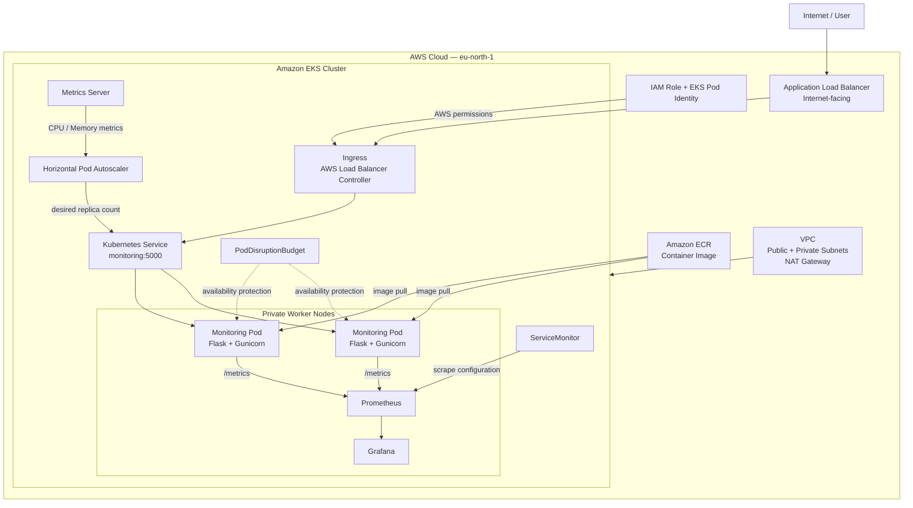
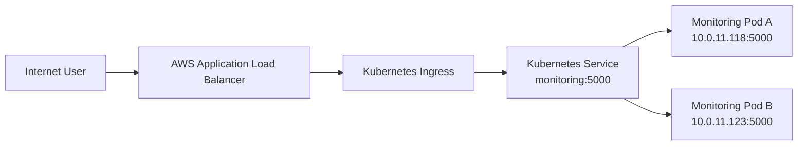
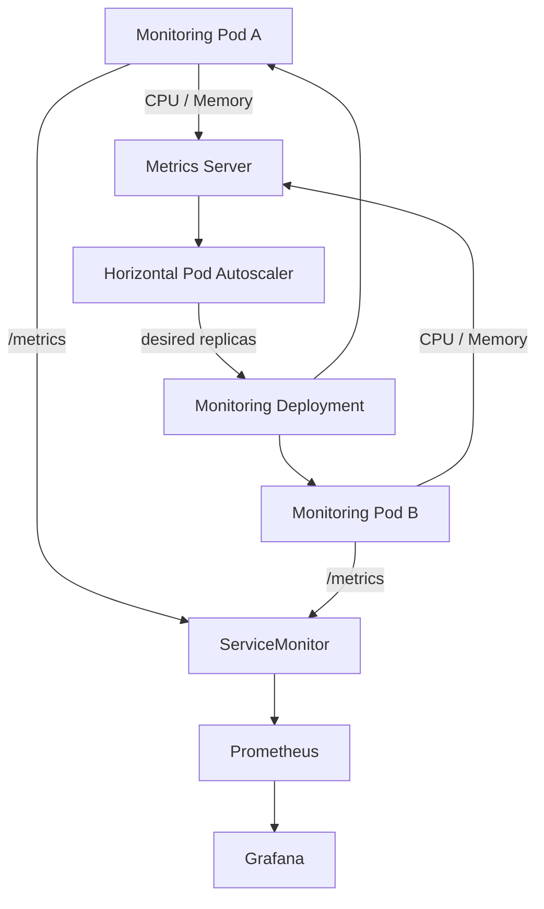
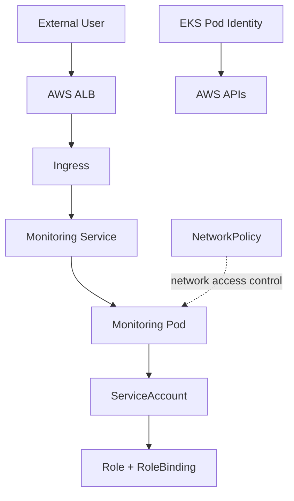

# Cloud Native Monitoring on Kubernetes & Amazon EKS

A production-oriented Kubernetes monitoring project built to develop and validate real-world DevOps operational skills across local Kubernetes and Amazon EKS.

The project started with a local Kubernetes environment using Kind to build a strong operational understanding of Kubernetes workloads, networking, configuration, health checks, resources, autoscaling, security, scheduling, and troubleshooting.

The workload was then moved into Amazon EKS to validate those concepts in a realistic cloud environment and to implement AWS-specific capabilities such as VPC networking, private worker nodes, EKS Pod Identity, AWS Load Balancer Controller, Application Load Balancer ingress, Amazon ECR, Metrics Server, Prometheus, and Grafana.

Rather than focusing only on successful deployments, the project deliberately introduced failures and operational problems and then diagnosed and recovered from them using Kubernetes and AWS tooling.

The resulting workflow covers the complete path:

**Infrastructure → Container → Kubernetes → AWS Load Balancer → Application → Metrics → Prometheus → Grafana → Autoscaling → Failure → Diagnosis → Recovery**

---

## Project Goals

The primary goals of this project were to:

* Build practical Kubernetes operational knowledge rather than only learning Kubernetes syntax.
* Understand how Kubernetes workloads behave under normal and failure conditions.
* Deploy and operate a containerized application on Amazon EKS.
* Build an observability pipeline using Prometheus and Grafana.
* Expose an EKS workload through an AWS Application Load Balancer.
* Use EKS Pod Identity instead of static AWS credentials inside workloads.
* Implement Kubernetes autoscaling using Metrics Server and HPA.
* Apply Kubernetes RBAC and NetworkPolicy controls.
* Practice node operations using cordon and drain.
* Validate graceful application shutdown.
* Protect application availability with a PodDisruptionBudget.
* Intentionally break components and troubleshoot the resulting failures.
* Develop the operational debugging mindset expected from a DevOps engineer.

---

## What Makes This Project Different

This project was not treated as a simple "deploy an application to Kubernetes" exercise.

The focus was on answering operational questions such as:

* What happens when a Kubernetes dependency is missing?
* How do I determine why a Pod is not starting?
* How do I distinguish an application failure from a Kubernetes configuration failure?
* What happens when a container exceeds its memory limit?
* What happens when a Deployment references an invalid image?
* How does Kubernetes recover from a failed rollout?
* How does HPA obtain resource metrics?
* How does RBAC determine whether a workload can perform an API operation?
* Why might a NetworkPolicy appear to have no effect?
* How does Kubernetes behave when a node is drained?
* What happens when a replacement Pod cannot be scheduled?
* How do Prometheus and ServiceMonitor discover application metrics?
* How can an observability component itself become resource-constrained?
* How does an AWS load balancer reach private Kubernetes Pods?

These scenarios were tested hands-on wherever practical.

---

## High-Level Result

The final EKS environment consisted of:

* Amazon EKS cluster running Kubernetes `1.35`
* Two private worker nodes using `t3.small` instances
* Private worker subnet with NAT connectivity
* Dedicated control-plane subnet
* Public subnets for the internet-facing Application Load Balancer
* AWS Load Balancer Controller
* EKS Pod Identity
* Amazon ECR
* Kubernetes Deployment with two application replicas
* Kubernetes Service
* AWS Application Load Balancer through Kubernetes Ingress
* Prometheus
* Grafana
* ServiceMonitor
* Metrics Server
* Horizontal Pod Autoscaler
* RBAC
* NetworkPolicy
* PodDisruptionBudget

The application exposes both a browser-based monitoring dashboard and a Prometheus-compatible `/metrics` endpoint.

---

## Final Architecture



---

## Key Traffic and Observability Flows

### User Traffic

```text
Internet
   ↓
AWS Application Load Balancer
   ↓
Kubernetes Ingress
   ↓
Kubernetes Service
   ↓
Monitoring Pod
   ↓
Flask Application
```

### Application Metrics

```text
Monitoring Pod
   ↓
/metrics
   ↓
ServiceMonitor
   ↓
Prometheus
   ↓
Grafana
```

### Autoscaling

```text
Kubernetes Pods
   ↓
CPU / Memory usage
   ↓
Metrics Server
   ↓
Horizontal Pod Autoscaler
   ↓
Deployment replica count
   ↓
More / fewer Pods
```

### AWS Authentication

```text
AWS Load Balancer Controller
          ↓
Kubernetes ServiceAccount
          ↓
EKS Pod Identity
          ↓
IAM Role
          ↓
AWS API permissions
```

---

## Project Outcome

The project resulted in a functioning cloud-native monitoring platform where the application could be accessed through an AWS Application Load Balancer, application metrics were collected by Prometheus, metrics were visualized through Grafana, workload replicas could scale through HPA, and Kubernetes availability and security mechanisms could be tested through deliberate operational scenarios.

More importantly, the project provided hands-on experience with **observing, breaking, diagnosing, recovering, and validating Kubernetes workloads** rather than only provisioning them.

## Technology Stack

| Category                  | Technology                    | Purpose                                              |
| ------------------------- | ----------------------------- | ---------------------------------------------------- |
| Cloud                     | Amazon Web Services (AWS)     | Cloud infrastructure and managed Kubernetes          |
| Kubernetes                | Amazon EKS                    | Production-context Kubernetes environment            |
| Local Kubernetes          | Kind                          | Local Kubernetes learning and validation             |
| Infrastructure as Code    | Terraform                     | VPC and EKS infrastructure provisioning              |
| Containerization          | Docker                        | Application containerization                         |
| Container Registry        | Amazon ECR                    | Private container image storage                      |
| Application               | Python / Flask                | Cloud-native monitoring application                  |
| Application Server        | Gunicorn                      | Production WSGI server                               |
| Application Metrics       | Prometheus Client             | Exposing application metrics                         |
| System Metrics            | psutil                        | CPU and memory collection                            |
| Load Balancing            | AWS Application Load Balancer | External HTTP traffic                                |
| Ingress                   | Kubernetes Ingress            | Application routing                                  |
| AWS Integration           | AWS Load Balancer Controller  | Creates and manages AWS load balancers               |
| AWS Identity              | EKS Pod Identity              | IAM permissions for Kubernetes workloads             |
| Monitoring                | Prometheus                    | Metrics collection and time-series monitoring        |
| Visualization             | Grafana                       | Metrics visualization and dashboards                 |
| Kubernetes Metrics        | Metrics Server                | Resource metrics for Kubernetes/HPA                  |
| Autoscaling               | Horizontal Pod Autoscaler     | Dynamic workload scaling                             |
| Security                  | Kubernetes RBAC               | API authorization                                    |
| Security                  | Kubernetes NetworkPolicy      | Pod network traffic control                          |
| Availability              | PodDisruptionBudget           | Availability protection during voluntary disruptions |
| Package Management        | Helm                          | Kubernetes application installation and management   |
| CI/CD / Registry Workflow | GitHub + Amazon ECR           | Source control and container image workflow          |

---

# Repository Structure

The repository is organized around the application, Kubernetes manifests, AWS infrastructure, and operational documentation.

```text
cloud-native-monitoring/
│
├── app.py
├── Dockerfile
├── .dockerignore
├── requirements-runtime.txt
│
├── templates/
│   └── index.html
│
├── k8s/
│   ├── namespace.yaml
│   ├── deployment.yaml
│   ├── service.yaml
│   ├── ingress.yaml
│   ├── configmap.yaml
│   ├── secret.yaml
│   ├── serviceaccount.yaml
│   ├── role.yaml
│   ├── rolebinding.yaml
│   ├── networkpolicy.yaml
│   ├── hpa.yaml
│   ├── pdb.yaml
│   ├── servicemonitor.yaml
│   └── prometheus-values.yaml
│
├── terraform/
│   ├── main.tf
│   ├── variables.tf
│   ├── outputs.tf
│   └── ...
│
└── README.md
```

> The exact file set may evolve as the project is cleaned up, but the repository is intentionally separated into **application**, **Kubernetes**, and **infrastructure** concerns.

---

# Application

The project uses a lightweight Flask application as the monitored workload.

The application provides three important endpoints:

### `/`

The browser-facing monitoring dashboard.

It displays:

* CPU usage
* Memory usage
* Current Pod hostname
* High-resource warning when CPU or memory exceeds the configured threshold

This endpoint provides a simple visual way to confirm that traffic is reaching the actual Kubernetes Pod.

### `/healthz`

A lightweight health endpoint used by Kubernetes health checks and container health checks.

```text
GET /healthz

→ {"status": "ok"}
```

The endpoint is intentionally simple so that health checks test application availability without depending on the monitoring UI.

### `/metrics`

The Prometheus metrics endpoint.

The application exposes custom metrics including:

```text
monitoring_cpu_usage_percent
monitoring_memory_usage_percent
```

These metrics are scraped by Prometheus through the Kubernetes ServiceMonitor.

---

# Containerization

The application is packaged as a Docker image based on:

```dockerfile
python:3.11-slim-bookworm
```

Gunicorn is used as the application server rather than Flask's development server.

The container also runs the application as a dedicated non-root user:

```text
appuser
```

This provides a safer container runtime configuration than running the application as root.

The image includes a Docker `HEALTHCHECK` against `/healthz`.

---

# Kubernetes Workload

The application is deployed through a Kubernetes Deployment with:

```text
Replicas: 2
```

Running multiple replicas provides basic application availability and also allows operational experiments such as:

* rolling updates
* Pod failure
* HPA scaling
* node drain
* PodDisruptionBudget testing
* cross-node replica placement

The two application replicas were intentionally distributed across the two EKS worker nodes during the final deployment.

---

# Infrastructure as Code

Terraform is used to provision the AWS infrastructure required for the EKS environment.

The infrastructure includes:

* VPC
* public subnets
* private worker subnet
* dedicated control-plane subnet
* route tables
* Internet Gateway
* NAT Gateway
* Elastic IP
* EKS cluster
* managed node group

The worker nodes operate in a private subnet while public subnets are available for internet-facing AWS load-balancer resources.

The project therefore separates:

```text
Public infrastructure
        ↓
Internet-facing load balancing

Private infrastructure
        ↓
EKS worker nodes
        ↓
Application Pods
```

---

# Helm-Managed Components

Several Kubernetes components were installed and managed using Helm.

### AWS Load Balancer Controller

Responsible for translating Kubernetes Ingress resources into AWS load-balancer infrastructure.

### Metrics Server

Provides CPU and memory resource metrics to Kubernetes and enables HPA functionality.

### kube-prometheus-stack

Provides the observability stack consisting of:

* Prometheus
* Grafana
* Alertmanager
* Prometheus Operator
* kube-state-metrics
* node-exporter

Helm made it possible to deploy and manage this relatively large monitoring stack without manually creating every individual Kubernetes resource.

---

# Configuration Philosophy

The project deliberately separates responsibilities:

```text
Terraform
    ↓
AWS infrastructure

Helm
    ↓
Platform components

Kubernetes manifests
    ↓
Application workloads and policies

Docker
    ↓
Application packaging

Prometheus / Grafana
    ↓
Observability
```

This separation makes the system easier to understand, troubleshoot, and eventually evolve toward a production deployment model.

# Development Journey: Kind → Amazon EKS

The project was intentionally developed in two phases.

The first phase used **Kind (Kubernetes in Docker)** to build and validate Kubernetes operational knowledge locally.

The second phase moved the workload into **Amazon EKS** to validate those concepts in a real AWS environment and introduce cloud-specific infrastructure, networking, identity, load balancing, and observability.

This separation made it possible to learn Kubernetes deeply without unnecessarily consuming AWS resources.

---

# Phase 1 — Local Kubernetes with Kind

## Why Kind?

Kind was used as the local Kubernetes environment because it provides a real Kubernetes control plane and worker-node experience while running locally in Docker.

The goal was not simply to avoid AWS costs.

The local environment allowed Kubernetes behavior to be tested quickly and repeatedly without waiting for cloud infrastructure or worrying about AWS resource consumption.

This was especially useful for deliberately breaking workloads and observing Kubernetes behavior.

---

## Kubernetes Concepts Validated Locally

The Kind phase was used to understand and practice:

* Deployments
* ReplicaSets
* Pods
* Services
* Labels and selectors
* ConfigMaps
* Secrets
* Container resource requests and limits
* Startup, readiness, and liveness probes
* Rolling updates
* Rollbacks
* Horizontal Pod Autoscaling
* ServiceAccounts
* RBAC
* NetworkPolicies
* Logs and container debugging
* Pod execution with `kubectl exec`
* Scheduling behavior
* Graceful shutdown
* Kubernetes reconciliation

The focus was on understanding **why Kubernetes behaves a certain way**, rather than memorizing YAML fields.

---

# Kubernetes Operational Mental Model

A central concept developed during the project was the Kubernetes reconciliation model.

The desired state is declared through resources such as Deployments.

For example:

```text
Desired state:

Deployment
replicas: 2

        ↓

Kubernetes controllers continuously observe
the actual cluster state.

        ↓

If actual state differs:

Actual state:
1 Pod

        ↓

Deployment controller creates
another Pod.

        ↓

Actual state:
2 Pods
```

This same reconciliation model appeared repeatedly during the failure labs.

---

# Deliberate Failure Testing

The local environment was also used to introduce controlled failures.

Examples included:

```text
Deployment configuration
        ↓
Intentional failure
        ↓
Observe Kubernetes state
        ↓
kubectl get / describe / logs
        ↓
Identify root cause
        ↓
Fix configuration
        ↓
Observe reconciliation
```

This established the debugging workflow used later on EKS.

---

# What Changed When Moving to EKS?

The Kubernetes concepts remained largely the same.

What changed was the infrastructure surrounding Kubernetes.

```text
Kind

Developer machine
      ↓
Docker
      ↓
Kubernetes


Amazon EKS

AWS VPC
      ↓
EKS Control Plane
      ↓
Private Worker Nodes
      ↓
AWS networking
      ↓
AWS IAM
      ↓
AWS Load Balancer
      ↓
Cloud observability
```

The EKS phase therefore focused less on repeating Kubernetes fundamentals and more on understanding how Kubernetes operates inside AWS.

---

# Phase 2 — Amazon EKS

The final cloud environment was built in the AWS `eu-north-1` region.

The EKS cluster was named:

```text
cloud-native-monitoring-eks
```

The cluster ran Kubernetes:

```text
v1.35
```

The worker environment consisted of two `t3.small` SPOT instances.

The small node size was intentional because the project was designed to maximize hands-on learning while controlling AWS costs.

---

# AWS Network Architecture

The EKS environment used a VPC with:

```text
CIDR: 10.0.0.0/16
```

The infrastructure was divided into public and private networking.

### Public Subnets

Public subnets were used for AWS load-balancer infrastructure.

They were configured with routes to the Internet Gateway and tagged for AWS load-balancer discovery.

### Private Worker Subnet

The EKS worker nodes were placed in a private subnet:

```text
10.0.11.0/24
```

The subnet used a NAT Gateway for outbound internet connectivity.

This allowed worker nodes to reach required external services without exposing the nodes directly to the public internet.

### Dedicated Control-Plane Subnet

A separate subnet was used for control-plane networking:

```text
10.0.12.0/24
```

This subnet was not used as a public load-balancer subnet.

### Second Public Subnet

A second public subnet was created in another Availability Zone so that the internet-facing Application Load Balancer could span multiple Availability Zones.

This became an important practical AWS networking lesson:

> An internet-facing AWS load balancer requires appropriate public subnets in multiple Availability Zones.

---

# EKS Worker Architecture

The final worker topology was:

```text
EKS Cluster
│
├── Worker Node
│   └── 10.0.11.234
│
└── Worker Node
    └── 10.0.11.85
```

The monitoring application ran two replicas and was distributed across the two worker nodes.

This provided basic fault isolation and also allowed node-level operational exercises such as cordon and drain.

---

# AWS-Specific Components

The EKS phase introduced capabilities that cannot be meaningfully reproduced with a basic local Kind cluster.

These included:

### Amazon ECR

Used as the private container registry for the application image.

```text
Docker build
     ↓
Amazon ECR
     ↓
EKS Pod
```

### AWS Load Balancer Controller

Connected Kubernetes Ingress resources to AWS Application Load Balancers.

### EKS Pod Identity

Provided AWS permissions to the AWS Load Balancer Controller without placing static AWS credentials inside the Pod.

### Application Load Balancer

Provided external HTTP access to the Kubernetes application.

### NAT Gateway

Provided outbound connectivity for private worker nodes.

---

# Why the Two-Phase Approach Matters

The final project intentionally follows this principle:

```text
Learn locally
     ↓
Break locally
     ↓
Understand behavior
     ↓
Move to AWS
     ↓
Validate in production-like infrastructure
     ↓
Learn AWS-specific behavior
```

This reduced unnecessary cloud usage while still providing hands-on experience with the AWS components that matter for EKS operations.

The result was not simply a local Kubernetes project deployed to AWS.

It became a progression from:

**Kubernetes fundamentals → Kubernetes operations → AWS infrastructure → EKS operations → cloud-native observability → failure recovery.**


# Application & Kubernetes Workload

The monitoring workload is a lightweight Python Flask application designed specifically to provide a realistic Kubernetes workload rather than acting as a static "hello world" container.

The application collects host-level CPU and memory information, exposes a browser dashboard, provides a health endpoint for Kubernetes probes, and exposes Prometheus-compatible metrics.

---

## Application Architecture

The application exposes three primary endpoints:

```text id="c9x2qa"
                    Flask Application
                           │
             ┌─────────────┼─────────────┐
             │             │             │
             ▼             ▼             ▼
            `/`         `/healthz`    `/metrics`
             │             │             │
             ▼             ▼             ▼
       HTML Dashboard   Health Check   Prometheus
```

### `/` — Monitoring Dashboard

The root endpoint renders the custom HTML dashboard.

It displays:

* CPU usage
* Memory usage
* Pod hostname
* High CPU/memory warning when thresholds are exceeded

The Pod hostname is displayed deliberately so that traffic can be observed moving between different replicas.

For example, when Kubernetes routes requests to different Pods, the hostname can identify which Pod handled the request.

---

## `/healthz` — Health Endpoint

The application provides:

```text id="jjp1xs"
GET /healthz
```

which returns:

```json
{
  "status": "ok"
}
```

This endpoint is used by:

* Kubernetes health probes
* Docker `HEALTHCHECK`
* operational verification

Keeping the endpoint lightweight ensures that health checks measure application availability rather than depending on the dashboard rendering process.

---

## `/metrics` — Prometheus Endpoint

The application exposes Prometheus-compatible metrics:

```text id="d9h1nf"
monitoring_cpu_usage_percent
monitoring_memory_usage_percent
```

The endpoint uses the Prometheus Python client to generate the metrics in Prometheus exposition format.

This becomes the connection between the application and the observability stack:

```text id="6h4b6c"
Flask
  ↓
/metrics
  ↓
ServiceMonitor
  ↓
Prometheus
  ↓
Grafana
```

---

# Docker Containerization

The application is packaged using Docker.

The base image is:

```dockerfile id="u2u5jf"
FROM python:3.11-slim-bookworm
```

A slim Debian-based image was selected to keep the runtime relatively small while providing the required Python environment.

The image installs only the runtime dependencies defined in:

```text id="g5e6p1"
requirements-runtime.txt
```

The application source is then copied into the image.

---

## Gunicorn

The container runs the Flask application through Gunicorn:

```dockerfile id="x1a8n0"
CMD ["gunicorn", "--bind", "0.0.0.0:5000", "app:app"]
```

This avoids using Flask's development server for the containerized workload.

The application listens on:

```text id="k6w8s4"
0.0.0.0:5000
```

---

# Non-Root Container

The Docker image creates a dedicated application user:

```dockerfile id="n6f1sa"
RUN useradd --create-home --shell /usr/sbin/nologin appuser
```

and runs the container as:

```dockerfile id="m3y5kl"
USER appuser
```

This means the Flask/Gunicorn process does not run as root.

The configuration was validated during the Kubernetes debugging exercises using:

```bash
whoami
```

inside the running Pod.

The result was:

```text
appuser
```

---

# Docker Healthcheck

The image also includes a Docker-level health check:

```dockerfile id="z8v1mc"
HEALTHCHECK --interval=30s --timeout=5s --start-period=15s --retries=3 \
  CMD python -c "import os, urllib.request; urllib.request.urlopen('http://127.0.0.1:%s/healthz' % os.environ.get('PORT', '5000'), timeout=3).read()" || exit 1
```

This provides a container-runtime-level health signal independent of Kubernetes.

---

# `.dockerignore`

A dedicated `.dockerignore` was created to prevent unnecessary files from entering the Docker build context.

It excludes categories such as:

* Git metadata
* Terraform state
* Kubernetes manifests
* environment files
* Python virtual environments
* caches
* tests
* IDE files
* documentation
* logs
* temporary files
* local AWS state

This keeps the build context focused on what the runtime image actually needs.

---

# Amazon ECR

The application image was stored in Amazon Elastic Container Registry.

Repository:

```text id="4h5v9s"
574921529429.dkr.ecr.eu-north-1.amazonaws.com/my_monitoring_app_image
```

The image workflow was:

```text id="w2t6mc"
Application Source
       ↓
Docker Build
       ↓
Local Image
       ↓
Amazon ECR
       ↓
EKS Deployment
       ↓
Kubernetes Pods
```

The project used versioned image tags instead of relying exclusively on `latest`.

This became particularly important during one of the Prometheus debugging incidents when a stale ECR image was initially running in the cluster.

---

# Kubernetes Namespace

The monitoring workload and observability components were organized under the `monitoring` namespace.

This provides isolation from system workloads running in namespaces such as `kube-system`.

```text id="x4y1zo"
EKS Cluster
│
├── kube-system
│   └── AWS / Kubernetes system components
│
└── monitoring
    ├── Monitoring application
    ├── Prometheus
    ├── Grafana
    ├── Alertmanager
    └── monitoring operators
```

---

# Deployment

The application was deployed using a Kubernetes Deployment.

The final workload used:

```text id="8m2xqf"
replicas: 2
```

Two replicas provided:

* basic availability
* rolling-update capability
* load distribution
* HPA scaling starting point
* node-drain testing
* PodDisruptionBudget testing

The replicas were running across the two EKS worker nodes.

---

# Kubernetes Service

A ClusterIP Service exposes the application internally:

```text id="k4w9qz"
Service
  monitoring
  port: 5000
```

The Service selects the application Pods using Kubernetes labels.

The traffic flow is:

```text id="v8r0k2"
AWS ALB
   ↓
Ingress
   ↓
Service
   ↓
Pod IP:5000
```

The Service therefore provides a stable Kubernetes endpoint even though individual Pod IP addresses are ephemeral.

---

# Configuration and Secrets

Application configuration was separated from the container image using Kubernetes configuration resources.

This follows the Kubernetes principle of separating:

```text id="n7p3xq"
Application image
        +
Runtime configuration
        +
Sensitive configuration
```

rather than rebuilding the image whenever runtime configuration changes.

Secrets were also deliberately tested by temporarily removing required configuration and observing the resulting `FailedMount` behavior.

This reinforced an important debugging rule:

> When a Pod cannot start, inspect both the container and the Kubernetes resources it depends on.

---

# Resource Requests and Limits

The application was given explicit resource requests and limits.

The final application configuration used approximately:

```text id="s4m8zk"
CPU request:       50m
CPU limit:         200m

Memory request:    64Mi
Memory limit:      128Mi
```

These values were intentionally tested rather than treated as arbitrary YAML values.

During an OOM failure lab, the memory limit was deliberately reduced enough to trigger:

```text id="g9d2xv"
OOMKilled
Exit Code 137
CrashLoopBackOff
```

The workload was then restored to appropriate resource limits and verified as healthy.

This provided practical experience with the difference between:

* requested resources
* resource limits
* actual resource consumption
* Kubernetes scheduling
* container termination due to memory pressure

---

# Application Startup Behavior

The application intentionally includes a startup delay during the project:

```python id="r7n2vc"
time.sleep(20)
```

This was useful for testing Kubernetes startup behavior.

The initial probe configuration failed while the application was still starting, then recovered once the application became ready.

This demonstrated why startup-sensitive applications may require an appropriate:

```text
startupProbe
```

rather than immediately treating slow startup as application failure.

---

# Final Application Flow

The completed workload can therefore be viewed as:

```text id="e5m2ax"
                Docker Image
                     │
                     ▼
                Amazon ECR
                     │
                     ▼
              Kubernetes Deployment
                     │
              ┌──────┴──────┐
              ▼             ▼
           Pod A          Pod B
              │             │
              └──────┬──────┘
                     ▼
              Kubernetes Service
                     │
                     ▼
             AWS ALB / Ingress
                     │
                     ▼
                  Internet
```

While the observability path runs independently:

```text id="r2p8mx"
Pod A ──┐
        ├── /metrics ──→ Prometheus ──→ Grafana
Pod B ──┘
```

This separation between **application traffic** and **observability traffic** is a fundamental part of the final project architecture.


# AWS Load Balancer Controller & Ingress

After validating the application and Kubernetes Service, the next requirement was to expose the application outside the EKS cluster.

For the EKS phase, the project used the **AWS Load Balancer Controller** to translate a Kubernetes `Ingress` resource into an AWS Application Load Balancer (ALB).

The resulting traffic path is:

```text
Internet
   │
   ▼
AWS Application Load Balancer
   │
   ▼
Kubernetes Ingress
   │
   ▼
Kubernetes Service
   │
   ▼
Monitoring Pod IP:5000
```

This provided hands-on experience with the boundary between Kubernetes networking and AWS networking.

---

## Why Use an Ingress?

A Kubernetes Service provides stable access to Pods inside the cluster, but it does not by itself provide the desired AWS internet-facing entry point.

The project therefore introduced an Ingress:

```text
Internet
   ↓
ALB
   ↓
Ingress
   ↓
Service
   ↓
Pods
```

The Ingress describes the desired HTTP routing behavior.

The AWS Load Balancer Controller watches that Kubernetes resource and creates/configures the corresponding AWS infrastructure.

This is an example of Kubernetes' declarative model being extended into AWS:

```text
Kubernetes desired state
          ↓
Ingress resource
          ↓
AWS Load Balancer Controller
          ↓
AWS API
          ↓
Application Load Balancer
```

---

# AWS Load Balancer Controller

The AWS Load Balancer Controller runs inside the EKS cluster and watches Kubernetes resources such as:

* Ingress
* Service

For this project, it was installed through Helm.

```bash
helm upgrade --install aws-load-balancer-controller \
  eks/aws-load-balancer-controller \
  --version 3.5.0 \
  -n kube-system \
  --set clusterName=cloud-native-monitoring-eks \
  --set serviceAccount.create=false \
  --set serviceAccount.name=aws-load-balancer-controller \
  --set region=eu-north-1 \
  --set vpcId=vpc-09af8dfafcae2b6f3
```

The controller was verified as healthy with two running replicas.

---

# IAM and EKS Pod Identity

The controller needs permission to communicate with AWS APIs.

Instead of storing AWS access keys inside the Pod, the project used **EKS Pod Identity**.

The mental model is:

```text
IAM Policy
    │
    │ WHAT can it do?
    ▼
IAM Role
    │
    │ WHO receives those permissions?
    ▼
EKS Pod Identity
    │
    │ WHICH workload?
    ▼
ServiceAccount
    │
    ▼
AWS Load Balancer Controller
```

This separates AWS permissions from application credentials.

---

## IAM Policy

An IAM policy named:

```text
AWSLoadBalancerControllerIAMPolicy
```

defines the AWS API permissions required by the controller.

The policy represents:

> **WHAT the workload is allowed to do.**

---

## IAM Role

The controller uses:

```text
AmazonEKSLoadBalancerControllerRole
```

The role represents:

> **WHO receives those permissions.**

The role trust relationship allows the EKS Pod Identity service principal:

```json
{
  "Version": "2012-10-17",
  "Statement": [
    {
      "Effect": "Allow",
      "Principal": {
        "Service": "pods.eks.amazonaws.com"
      },
      "Action": [
        "sts:AssumeRole",
        "sts:TagSession"
      ]
    }
  ]
}
```

---

# Pod Identity Association

The role was associated with the controller's Kubernetes ServiceAccount:

```text
Cluster:
cloud-native-monitoring-eks

Namespace:
kube-system

ServiceAccount:
aws-load-balancer-controller
```

The resulting relationship is:

```text
aws-load-balancer-controller
            │
            ▼
       EKS Pod Identity
            │
            ▼
AmazonEKSLoadBalancerControllerRole
            │
            ▼
AWS APIs
```

No static AWS access key or secret key was placed inside the controller Pod.

---

# Ingress Configuration

The application Ingress uses the AWS Load Balancer Controller:

```yaml
apiVersion: networking.k8s.io/v1
kind: Ingress
metadata:
  name: monitoring
  namespace: monitoring
  annotations:
    alb.ingress.kubernetes.io/scheme: internet-facing
    alb.ingress.kubernetes.io/target-type: ip
spec:
  ingressClassName: alb
  rules:
    - http:
        paths:
          - path: /
            pathType: Prefix
            backend:
              service:
                name: monitoring
                port:
                  number: 5000
```

The important configuration choices were:

### `internet-facing`

```yaml
alb.ingress.kubernetes.io/scheme: internet-facing
```

The ALB is reachable from the public Internet.

### `target-type: ip`

```yaml
alb.ingress.kubernetes.io/target-type: ip
```

The ALB sends traffic directly to Pod IP addresses rather than targeting the EC2 worker nodes.

This makes the final path:

```text
ALB
 ↓
Pod IP
 ↓
Container port 5000
```

rather than:

```text
ALB
 ↓
Node
 ↓
NodePort
 ↓
Pod
```

---

# AWS Subnet Requirements

The ALB required appropriate public subnets across availability zones.

The project therefore used public subnets in:

```text
eu-north-1a
eu-north-1b
```

with the Kubernetes AWS Load Balancer Controller subnet role tag:

```text
kubernetes.io/role/elb=1
```

The worker workload remained in the private subnet.

This produced a useful separation:

```text
                    Internet
                       │
                       ▼
             ┌─────────────────┐
             │ Public Subnets  │
             │                 │
             │      ALB        │
             └────────┬────────┘
                      │
                      ▼
             ┌─────────────────┐
             │ Private Subnet  │
             │                 │
             │ EKS Worker Node │
             │      │          │
             │      ▼          │
             │ Monitoring Pod  │
             └─────────────────┘
```

The worker node therefore did not need to be directly exposed to the Internet.

---

# ALB Target Group

The resulting ALB used an AWS target group configured for:

```text
Protocol: HTTP
Port:     5000
Target:   IP
```

The monitoring Pod IPs became the registered targets.

At validation time, both application Pods were healthy targets.

The health path used by the ALB was:

```text
/
```

while Kubernetes/application health validation also used:

```text
/healthz
```

This gave two useful levels of verification:

```text
AWS ALB
  ↓
Target health
  ↓
Pod
  ↓
Application
```

---

# End-to-End Request

A request to the ALB follows this path:

```text
1. User
   │
   ▼
2. Internet-facing ALB
   │
   ▼
3. ALB Target Group
   │
   ▼
4. Pod IP
   │
   ▼
5. Kubernetes Pod
   │
   ▼
6. Gunicorn
   │
   ▼
7. Flask application
```

For the dashboard:

```text
GET /
```

returns the monitoring UI.

For health verification:

```text
GET /healthz
```

returns:

```json
{
  "status": "ok"
}
```

For observability:

```text
GET /metrics
```

returns Prometheus-formatted metrics.

---

# Validation

The ALB was validated from outside the cluster using its AWS DNS name.

The resulting endpoint had the structure:

```text
k8s-monitori-monitori-<identifier>.eu-north-1.elb.amazonaws.com
```

The ALB successfully served the custom monitoring dashboard.

The dashboard displayed:

* CPU usage
* memory usage
* Pod hostname

This also provided a simple way to observe requests reaching different replicas.

---

# Debugging the Load Balancer Layer

Several layers had to work simultaneously:

```text
Internet
   ↓
AWS ALB
   ↓
Target Group
   ↓
Pod IP
   ↓
Kubernetes Service / Ingress
   ↓
Application
```

When troubleshooting this path, the project used a layered approach rather than immediately changing Kubernetes YAML.

The checks were conceptually:

```text
1. Does the ALB exist?
2. Is the ALB listener configured?
3. Are target group targets registered?
4. Are targets healthy?
5. Does the Ingress exist?
6. Does the Service have endpoints?
7. Are Pods Ready?
8. Is the application listening on port 5000?
9. Does /healthz respond?
```

This approach helps isolate whether a failure belongs to:

* AWS networking
* Load Balancer Controller
* Ingress
* Kubernetes Service
* Pod networking
* application runtime

---

# Key DevOps Lesson

The important lesson from this part of the project was that an Ingress is not simply "another YAML file."

It represents a chain of dependencies:

```text
Ingress
  ↓
Controller
  ↓
IAM permissions
  ↓
AWS API
  ↓
ALB
  ↓
Subnets / networking
  ↓
Target registration
  ↓
Pod reachability
```

A failure anywhere in that chain can make the application appear unreachable.

The debugging mindset therefore became:

> **Follow the request path layer by layer instead of guessing at the manifest.**

---

# Final Traffic Architecture

The completed external traffic architecture is:



This completed the AWS-facing application path while keeping the EKS worker nodes and application Pods in the private network.

The next layer is **Prometheus, ServiceMonitor, Metrics Server, Grafana, and HPA**—the observability and autoscaling portion of the project.


# Observability & Autoscaling

The monitoring application was designed to demonstrate the complete Kubernetes observability path:

```text
Application
    │
    ├── /metrics
    │
    ▼
ServiceMonitor
    │
    ▼
Prometheus
    │
    ▼
PromQL
    │
    ▼
Grafana
```

A separate metrics path was used for Kubernetes autoscaling:

```text
Kubernetes Nodes / Pods
        │
        ▼
Metrics Server
        │
        ▼
Horizontal Pod Autoscaler
        │
        ▼
Deployment replica count
```

These two systems solve related but different problems.

**Prometheus/Grafana** answer:

> What is happening in the system?

**Metrics Server/HPA** answer:

> Should Kubernetes change the number of application replicas?

---

# Prometheus

Prometheus was deployed using the `kube-prometheus-stack` Helm chart.

The stack provided:

* Prometheus
* Grafana
* Alertmanager
* Prometheus Operator
* kube-state-metrics
* node-exporter
* Kubernetes monitoring resources

The project used Helm to install and manage the stack:

```bash id="a8s2lp"
helm upgrade monitoring-stack \
  prometheus-community/kube-prometheus-stack \
  -n monitoring \
  -f k8s/prometheus-values.yaml
```

The installed chart version was:

```text
kube-prometheus-stack: 91.4.1
```

with:

```text
Prometheus Operator / stack application: v0.94.0
```

---

# Application Metrics

The Flask application exposes custom metrics through:

```text
/metrics
```

The two primary application metrics are:

```text
monitoring_cpu_usage_percent
monitoring_memory_usage_percent
```

Prometheus periodically scrapes these values.

For the two application replicas, Prometheus therefore maintains separate time series.

Conceptually:

```text
Pod A ── /metrics ──┐
                    ├──→ Prometheus
Pod B ── /metrics ──┘
```

This makes it possible to inspect resource behavior at the individual Pod level.

---

# ServiceMonitor

Instead of manually configuring Prometheus scrape targets, the project used a Prometheus Operator `ServiceMonitor`.

```yaml id="r3v9ka"
apiVersion: monitoring.coreos.com/v1
kind: ServiceMonitor
metadata:
  name: monitoring
  namespace: monitoring
  labels:
    release: monitoring-stack
spec:
  selector:
    matchLabels:
      app: monitoring-app
  endpoints:
    - port: http
      path: /metrics
      interval: 15s
```

The important pieces are:

```text
ServiceMonitor
    │
    ├── selects the application Service
    │
    ├── uses port: http
    │
    ├── requests /metrics
    │
    └── scrapes every 15 seconds
```

---

# ServiceMonitor Selector

The ServiceMonitor selects the application using:

```yaml id="s1z4xq"
matchLabels:
  app: monitoring-app
```

This demonstrates an important Kubernetes concept:

> Monitoring configuration also depends on correct labels and selectors.

The ServiceMonitor does not simply scrape every Pod in the namespace.

It identifies the intended workload through labels.

---

# Prometheus Discovery Debugging

The ServiceMonitor initially contained the wrong release label.

The ServiceMonitor used:

```text
release: monitoring
```

while the Prometheus instance expected:

```text
release: monitoring-stack
```

As a result, Prometheus did not discover the intended ServiceMonitor.

After correcting the label, the ServiceMonitor became part of the Prometheus configuration.

This was a practical example of a Kubernetes failure where:

```text
Application is healthy
        +
Service is healthy
        +
Prometheus is healthy
        =
Metrics can still be missing
```

because the discovery relationship itself may be broken.

---

# Stale Container Image Incident

A second issue occurred after the ServiceMonitor configuration was corrected.

Prometheus still reported the target as unhealthy.

The target error indicated an unsupported content type:

```text
received unsupported Content-Type "application/json"
```

This suggested that `/metrics` was not actually returning Prometheus exposition data.

Instead of immediately changing Prometheus configuration, the application endpoint was tested directly.

The running container returned JSON from `/metrics`.

The running image was then inspected and found to be an older application artifact.

The problem was therefore not Prometheus itself.

It was:

```text
Old application image
        ↓
Old /metrics implementation
        ↓
JSON response
        ↓
Prometheus rejects target
```

A fresh image was built and pushed:

```text
my_monitoring_app_image:v11
```

The Deployment was updated to use the new image.

The endpoint then returned the expected Prometheus content type:

```text
text/plain; version=1.0.0; charset=utf-8
```

Prometheus subsequently showed both application targets as:

```text
2/2 UP
```

This became one of the project's most useful debugging lessons:

> When an observability system reports an application-level error, verify the actual running workload before changing the observability configuration.

---

# Prometheus Target Validation

The final Prometheus targets included both monitoring Pods.

Conceptually:

```text
monitoring Pod A
      │
      └── /metrics ──→ UP

monitoring Pod B
      │
      └── /metrics ──→ UP
```

The target page was used to verify:

* target discovery
* endpoint URL
* scrape status
* health
* scrape errors

This confirmed that the complete path was working:

```text
ServiceMonitor
      ↓
Prometheus discovery
      ↓
Pod endpoint
      ↓
/metrics
      ↓
Prometheus time series
```

---

# PromQL Validation

Once the targets were healthy, PromQL was used to query the custom application metrics.

Examples:

```promql id="y3k6dp"
monitoring_cpu_usage_percent
```

and:

```promql id="e9v1mq"
monitoring_memory_usage_percent
```

The queries returned metrics for the individual monitoring Pods.

This demonstrated the complete application-to-observability pipeline rather than merely confirming that Prometheus itself was running.

---

# Grafana

Grafana was used as the visualization layer on top of Prometheus.

The relationship is:

```text
Application
    ↓
Prometheus metrics
    ↓
PromQL
    ↓
Grafana panels
```

Grafana was accessed through Kubernetes port-forwarding:

```bash id="q5y8cn"
kubectl port-forward \
  -n monitoring \
  svc/monitoring-stack-grafana \
  3000:80
```

The Grafana dashboard visualized:

* CPU usage
* Memory usage
* application metrics
* Pod-level metric data

The custom dashboard provided a more useful operational view than looking at raw Prometheus output.

---

# Grafana Resource Incident

During the project, Grafana experienced repeated health failures and restarts.

The initial resource configuration was too restrictive for the workload.

The Pod showed an exit code associated with memory exhaustion:

```text
137
```

and had restarted multiple times.

Rather than simply restarting the Pod, resource usage was investigated.

The Grafana resources were increased to:

```yaml id="p7r2mb"
requests:
  cpu: 100m
  memory: 128Mi

limits:
  cpu: 300m
  memory: 512Mi
```

After the change, Grafana stabilized.

The final Grafana Pod reached:

```text
3/3 Running
0 restarts
```

Resource usage was also checked using:

```bash id="h4s1zv"
kubectl top pods -n monitoring
```

This reinforced that monitoring components themselves consume resources and must be treated as production workloads.

---

# Metrics Server

Prometheus and Metrics Server serve different purposes.

The project initially lacked Metrics Server after the EKS environment was recreated.

It was installed using Helm:

```bash id="c3h7mx"
helm upgrade --install metrics-server \
  metrics-server/metrics-server \
  -n kube-system
```

The installed chart was:

```text
metrics-server: 3.14.0
```

After installation, the Kubernetes metrics API became available.

Validation:

```bash id="z8n4vq"
kubectl top nodes
```

and:

```bash id="b5w7cm"
kubectl top pods -n monitoring
```

returned live CPU and memory usage.

---

# Prometheus vs Metrics Server

A key concept validated during the project was that these systems are not interchangeable.

| Component      | Primary purpose                             |
| -------------- | ------------------------------------------- |
| Prometheus     | Monitoring and time-series collection       |
| Grafana        | Visualization                               |
| Metrics Server | Lightweight resource metrics for Kubernetes |
| HPA            | Uses metrics to adjust replica count        |

The simplified architecture is:

```text
              ┌───────────────┐
              │ Application   │
              │ /metrics      │
              └───────┬───────┘
                      │
                      ▼
                ┌───────────┐
                │ Prometheus│
                └─────┬─────┘
                      │
                      ▼
                ┌──────────┐
                │ Grafana  │
                └──────────┘


       Kubernetes resource metrics
                    │
                    ▼
             ┌──────────────┐
             │Metrics Server│
             └──────┬───────┘
                    │
                    ▼
                  HPA
```

Prometheus was therefore used for observability while Metrics Server provided the resource metrics required by the HPA lab.

---

# Horizontal Pod Autoscaler

The application was configured with a Horizontal Pod Autoscaler.

The HPA was configured with:

```text
Minimum replicas: 2
Maximum replicas: 5
CPU target:       50%
```

Its mental model is:

```text
Metrics Server
      │
      ▼
Current CPU utilization
      │
      ▼
HPA calculates desired replicas
      │
      ▼
Deployment replica count changes
      │
      ▼
Kubernetes creates/removes Pods
```

The HPA therefore does not directly create Pods.

It changes the Deployment's desired replica count.

The Deployment and ReplicaSet then reconcile the actual state.

---

# HPA Scale-Up Test

A load generator was used to create CPU pressure against the monitoring application.

The workload progressed approximately as:

```text
2 replicas
    ↓
CPU load
    ↓
4 replicas
    ↓
continued load
    ↓
5 replicas
```

The maximum configured replica count was respected.

This validated the full autoscaling chain:

```text
HTTP load
   ↓
Application CPU usage
   ↓
Metrics Server
   ↓
HPA
   ↓
Deployment
   ↓
Additional Pods
```

---

# HPA Scale-Down Test

After the load generator was stopped, CPU utilization decreased.

The HPA then reduced the desired replica count:

```text
5 replicas
    ↓
load removed
    ↓
3 replicas
    ↓
2 replicas
```

The workload eventually returned to its configured minimum of two replicas.

This demonstrated both directions of HPA behavior rather than only proving that scale-up works.

---

# Why Two Metrics Systems Were Used

One of the most important architectural distinctions from this project is:

```text
                    Monitoring
                       │
          ┌────────────┴────────────┐
          │                         │
          ▼                         ▼
     Prometheus                Metrics Server
          │                         │
          ▼                         ▼
       Grafana                    HPA
          │                         │
          ▼                         ▼
  Human observation          Automated scaling
```

Prometheus/Grafana provide visibility for operators.

Metrics Server/HPA provide a control loop for Kubernetes autoscaling.

They complement each other rather than replacing one another.

---

# Final Observability Architecture



The final design therefore contains two complementary control paths:

### Observability path

```text
Application → Prometheus → Grafana
```

### Autoscaling path

```text
Workload → Metrics Server → HPA → Deployment
```

Together, these transformed the project from a simple Kubernetes deployment into an observable and dynamically scalable workload.


# Kubernetes Security & Access Control

The project included hands-on testing of Kubernetes security boundaries rather than treating security as a configuration-only exercise.

Three different layers were validated:

```text
Identity
   │
   ▼
ServiceAccount
   │
   ▼
RBAC
   │
   ▼
Kubernetes API permissions


Network identity
   │
   ▼
Pod labels / selectors
   │
   ▼
NetworkPolicy
   │
   ▼
Pod-to-Pod traffic
```

These mechanisms solve different problems.

* **ServiceAccount** — identifies a workload inside Kubernetes.
* **RBAC** — controls what that identity can do against the Kubernetes API.
* **NetworkPolicy** — controls which network traffic is allowed between Pods.

---

# ServiceAccount

The monitoring application uses a dedicated Kubernetes ServiceAccount rather than relying on an application-specific identity being implicit.

Conceptually:

```text
Monitoring Pod
      │
      ▼
ServiceAccount
      │
      ▼
Kubernetes identity
```

This creates a clear identity boundary for the workload.

The project also deliberately removed the required ServiceAccount during a failure exercise.

The result was a workload failure rather than an application-code failure.

This demonstrated an important debugging principle:

> Kubernetes workloads depend on resources outside the container itself.

When a Pod fails to start, the container image is only one possible source of the problem.

---

# RBAC

Role-Based Access Control was used to define the Kubernetes API permissions available to the monitoring workload.

The project created a Role granting read-only access to selected resources.

The tested permissions included:

```text
Pods:
  get
  list
  watch

Services:
  get
  list
  watch
```

The Role was then connected to the workload identity through a RoleBinding.

The resulting relationship is:

```text
ServiceAccount
      │
      ▼
RoleBinding
      │
      ▼
Role
      │
      ▼
Allowed API operations
```

---

# Least-Privilege Validation

The RBAC configuration was not considered complete simply because `kubectl apply` succeeded.

The permissions were actively tested.

A permitted operation such as retrieving Pods succeeded:

```text
GET Pods
→ 200 OK
```

A forbidden operation such as deleting a Pod was rejected:

```text
DELETE Pod
→ 403 Forbidden
```

This demonstrated the actual enforcement boundary.

The important distinction is:

```text
Authentication
    ≠
Authorization
```

The ServiceAccount provides an identity.

RBAC determines what that identity is authorized to do.

---

# RBAC Mental Model

A useful way to reason about RBAC is:

```text
WHO?
ServiceAccount
   │
   ▼
WHAT?
Role
   │
   ▼
HOW CONNECTED?
RoleBinding
   │
   ▼
WHERE?
Namespace
```

For example:

```text
monitoring ServiceAccount
        │
        ▼
monitoring Role
        │
        ├── get Pods
        ├── list Pods
        ├── watch Pods
        ├── get Services
        ├── list Services
        └── watch Services
```

Anything outside the granted permissions is denied.

---

# RBAC Debugging

The practical troubleshooting flow used during the lab was:

```text
1. Identify the ServiceAccount
2. Identify the Role
3. Inspect the RoleBinding
4. Check the requested API resource
5. Check the requested verb
6. Test the operation
7. Confirm allowed/denied behavior
```

This is more reliable than assuming that a Pod automatically has permission to perform Kubernetes API operations.

---

# NetworkPolicy

RBAC controls access to the Kubernetes API.

It does **not** control normal Pod-to-Pod network traffic.

For network isolation, the project used a Kubernetes `NetworkPolicy`.

The policy was designed to allow traffic to the monitoring application only from an explicitly identified source.

The conceptual model was:

```text
Source Pod
    │
    │ network request
    ▼
NetworkPolicy
    │
    ├── allowed source → ACCEPT
    │
    └── other source  → DENY
```

---

# EKS NetworkPolicy Enforcement

An important discovery occurred during the NetworkPolicy lab.

The NetworkPolicy object could exist successfully while having no practical enforcement effect because the EKS VPC CNI configuration initially had network-policy enforcement disabled:

```text
--enable-network-policy=false
```

This created an important distinction:

```text
NetworkPolicy exists
        ≠
NetworkPolicy is enforced
```

The CNI dataplane must actually support and enforce the policy.

NetworkPolicy enforcement was enabled before re-running the tests.

---

# NetworkPolicy Validation

After enforcement was enabled, the behavior became observable.

An unlabeled source workload attempting to access the monitoring application was denied.

A source workload with the expected label:

```text
access=monitoring
```

was allowed.

The resulting behavior was:

```text
Source Pod
    │
    ├── access=monitoring
    │       │
    │       ▼
    │     ALLOWED
    │
    └── no matching label
            │
            ▼
          DENIED
```

This validated that the policy was being enforced by the cluster networking layer rather than merely existing as an API object.

---

# RBAC vs NetworkPolicy

The project deliberately tested both controls because they operate at different layers.

| Mechanism      | Controls                     | Example                           |
| -------------- | ---------------------------- | --------------------------------- |
| ServiceAccount | Workload identity            | Which identity does the Pod use?  |
| RBAC           | Kubernetes API authorization | Can it list Pods?                 |
| NetworkPolicy  | Network connectivity         | Can this Pod connect to that Pod? |

For example:

```text
Pod A
 │
 ├── Kubernetes API request
 │       └── controlled by RBAC
 │
 └── Network request to Pod B
         └── controlled by NetworkPolicy
```

A workload can therefore have:

```text
RBAC permission
+
Network restriction
```

at the same time.

These are independent security boundaries.

---

# Security Failure Lab: Missing ServiceAccount

One deliberate failure removed the ServiceAccount expected by the workload.

The Deployment could still exist, but the Pod could not successfully establish all of its required Kubernetes resources.

The resulting failure demonstrated:

```text
Deployment
    ↓
Pod
    ↓
Required ServiceAccount missing
    ↓
Workload failure
```

The original configuration was then restored and the workload returned to normal operation.

---

# Security Failure Lab: Missing Secret

A similar test was performed with a Kubernetes Secret.

The Secret was deliberately removed while the workload still expected it.

The Pod reported a volume/mount failure:

```text
FailedMount
```

This reinforced the same operational principle:

> A Kubernetes Pod is the result of multiple resources working together.

When debugging startup failures, inspect:

```text
Pod
Deployment
ServiceAccount
ConfigMap
Secret
Volumes
Probes
Image
Resources
```

rather than looking only at application logs.

---

# Security Boundaries in the Final Architecture

The final project contains multiple security boundaries:



The important point is that no single mechanism provides all security controls.

Instead, different mechanisms protect different boundaries.

---

# Security Lessons

Several practical lessons came from these exercises.

### 1. Identity and authorization are different

A workload having a ServiceAccount does not automatically mean it can perform arbitrary Kubernetes API operations.

RBAC determines authorization.

### 2. RBAC and network security are different

RBAC controls Kubernetes API operations.

NetworkPolicy controls network connectivity.

### 3. A policy object is not enough

A NetworkPolicy can exist while the underlying networking implementation does not enforce it.

The dataplane must support the desired behavior.

### 4. Least privilege must be tested

The strongest evidence for an RBAC configuration was not the YAML itself.

It was:

```text
Allowed operation → 200 OK
Forbidden operation → 403 Forbidden
```

### 5. Kubernetes security is layered

The final security model combines:

```text
AWS IAM
   +
EKS Pod Identity
   +
ServiceAccounts
   +
RBAC
   +
NetworkPolicy
   +
Container non-root execution
```

Each layer addresses a different part of the workload's trust boundary.

---

# Operational Security Mental Model

The final mental model from this section is:

```text
WHO AM I?
    ↓
ServiceAccount

WHAT CAN I DO?
    ↓
RBAC

WHO CAN CONNECT TO ME?
    ↓
NetworkPolicy

WHAT AWS RESOURCES CAN I ACCESS?
    ↓
EKS Pod Identity + IAM

WHAT USER PRIVILEGES DOES THE CONTAINER HAVE?
    ↓
Non-root container user
```

This layered approach is more useful operationally than memorizing individual Kubernetes security objects.


# Reliability, Troubleshooting & Failure Engineering

A major goal of this project was to develop operational debugging skills rather than simply learning Kubernetes resources in isolation.

The workload was intentionally broken in controlled experiments and then recovered.

The overall approach was:

```text
Deploy
  ↓
Observe
  ↓
Break
  ↓
Investigate
  ↓
Identify root cause
  ↓
Recover
  ↓
Verify
```

This turned the project into a practical Kubernetes operations lab.

---

# Health Probes

The monitoring application used Kubernetes health probes to distinguish between:

* application startup
* application readiness
* application liveness

The application exposes:

```text
/healthz
```

as its health endpoint.

---

## Startup Probe

The application intentionally includes a 20-second startup delay.

This was used to test how Kubernetes behaves when an application needs additional time before becoming healthy.

The startup probe initially failed while the application was still starting.

After the application completed initialization, the probe succeeded and the Pod became healthy.

This demonstrated why startup probes are useful for applications that have a slow initialization phase.

The operational model is:

```text
Container starts
     ↓
Startup Probe
     │
     ├── still starting → allow time
     │
     └── startup complete
              ↓
       Readiness / Liveness
```

Without appropriate startup handling, Kubernetes may interpret a slow application as a failed application.

---

# Readiness Probe Failure Lab

The readiness endpoint was deliberately changed from:

```text
/healthz
```

to an invalid path:

```text
/healthz-broken
```

The Pod itself remained running, but it became:

```text
NotReady
```

This demonstrated the difference between:

```text
Running
```

and:

```text
Ready
```

A running container is not automatically considered capable of receiving application traffic.

The broken probe was restored and the Pod returned to Ready.

---

# Service Selector Failure Lab

The Service selector was deliberately changed so that it no longer matched the application Pods.

The Service remained present:

```text
Service
  monitoring
```

but its EndpointSlice became empty because no Pods matched the selector.

The traffic path effectively became:

```text
Client
  ↓
Service
  ↓
No matching endpoints
  ↓
No application response
```

The selector was restored and the endpoints returned.

This was an important demonstration of the Kubernetes label/selector model:

> A Service does not discover Pods by application name. It discovers them through matching labels.

---

# ImagePullBackOff Failure Lab

A deliberate rollout was performed using a nonexistent image tag:

```text
v999
```

The new Pods could not pull the image and entered:

```text
ImagePullBackOff
```

The important observation was that the existing healthy Pods remained available during the failed rollout.

The rollout was then reverted using:

```bash id="h8f0ke"
kubectl rollout undo deployment/monitoring \
  -n monitoring
```

The Deployment returned to the known-good image.

This demonstrated the practical relationship between:

```text
Rolling Update
     ↓
New ReplicaSet
     ↓
New Pods
     ↓
Failure
     ↓
Rollback
```

---

# OOMKilled Failure Lab

A memory-pressure failure was deliberately created by reducing the application's memory limit to an unrealistically low value.

The container eventually terminated with:

```text
OOMKilled
Exit Code: 137
```

The Pod entered:

```text
CrashLoopBackOff
```

The resource configuration was then restored.

This demonstrated the difference between:

```text
Application crash
```

and:

```text
Container killed because it exceeded its memory limit
```

The debugging workflow included inspecting:

```bash id="7a2xq9"
kubectl describe pod
kubectl logs
kubectl logs --previous
```

The resource configuration was corrected and the workload recovered.

---

# Container Runtime Debugging

A dedicated debugging exercise intentionally caused the application container to terminate with a non-zero exit code.

Before making the change, the healthy Deployment configuration was saved:

```bash id="q9v1dz"
kubectl get deployment monitoring \
  -n monitoring \
  -o yaml > /tmp/monitoring-before-debug-lab.yaml
```

The failure produced:

```text id="f6g3rm"
CrashLoopBackOff
```

The investigation used:

```text id="z8x5ep"
kubectl get pods
        ↓
kubectl describe pod
        ↓
kubectl logs
        ↓
kubectl logs --previous
```

The previous-container logs showed the deliberate command failure.

This exercise reinforced the difference between:

```text
Current container logs
```

and:

```text
Previous container logs
```

which are especially important after a restart.

---

# `kubectl exec` Investigation

A healthy application Pod was inspected from inside the container.

Commands such as:

```bash id="q7e4ns"
whoami
pwd
env
```

were used to verify the runtime environment.

The results confirmed:

```text
User: appuser
Working directory: /app
```

The exercise also revealed that common debugging utilities such as `ps` were not available in the slim application image.

This was a useful container-debugging lesson:

> Minimal images reduce unnecessary packages, but they also provide fewer debugging utilities.

The correct operational response is not automatically to install a large toolset into production images. Instead, debugging can be performed through:

* container logs
* Kubernetes events
* `kubectl describe`
* ephemeral/debug containers when appropriate
* purpose-built diagnostic images

---

# Gunicorn Read-Only Filesystem Issue

Running the application as a non-root user introduced another runtime issue.

Gunicorn attempted to use a location that was not writable under the container's restricted filesystem setup.

The problem was resolved by providing a writable `emptyDir` mount for the required Gunicorn runtime directory.

The resulting pattern was:

```text
Read-only application filesystem
          +
Writable temporary/runtime volume
          ↓
Gunicorn starts successfully
```

This was an important example of how security hardening can expose application runtime assumptions.

A container can be secure from a privilege perspective while still failing if its process expects writable filesystem locations.

---

# Graceful Shutdown

The application also implemented SIGTERM handling:

```text id="n7m2qs"
SIGTERM
   ↓
Application receives termination signal
   ↓
Graceful shutdown begins
   ↓
Container terminates
   ↓
Deployment creates replacement Pod
```

During the shutdown test, the logs showed:

```text id="6v9rpa"
Handling signal: term
Received SIGTERM - beginning graceful shutdown...
```

A Pod was then replaced by Kubernetes.

The replacement Pod became healthy.

This validated the expected behavior during:

* Pod deletion
* rolling updates
* node drains
* voluntary disruptions

---

# Scheduling Failure Lab

The scheduling behavior of Kubernetes was also tested deliberately.

A temporary node label was used to create a scheduling requirement.

A Pod with a matching scheduling constraint was successfully placed on the intended node.

The requirement was then changed to reference a label that did not exist.

The Pod became:

```text
Pending
```

The scheduler event explained that no node satisfied the scheduling requirement.

A second node was then given the required label.

The Pod became schedulable.

The experiment demonstrated:

```text
Pod scheduling requirement
        ↓
Scheduler evaluates nodes
        ↓
Matching node → schedule
No matching node → Pending
```

The temporary scheduling changes were then cleaned up.

---

# PodDisruptionBudget

A PodDisruptionBudget was created for the monitoring application:

```yaml id="j4c1tz"
apiVersion: policy/v1
kind: PodDisruptionBudget
metadata:
  name: monitoring-pdb
  namespace: monitoring
spec:
  minAvailable: 1
  selector:
    matchLabels:
      app: monitoring
```

The goal was to protect application availability during voluntary disruptions.

With two application replicas:

```text
Current:             2
Desired:             1
Allowed disruptions: 1
```

This meant Kubernetes could voluntarily disrupt one replica while maintaining at least one available replica.

---

# Node Drain & PDB Incident

The PDB was tested against an actual node drain.

First, one worker node was cordoned:

```text id="p6z0yn"
ip-10-0-11-234.eu-north-1.compute.internal
```

This prevented new workloads from being scheduled there.

The node was then drained:

```bash id="r2q1kj"
kubectl drain ip-10-0-11-234.eu-north-1.compute.internal \
  --ignore-daemonsets \
  --delete-emptydir-data
```

Kubernetes evicted the eligible workloads.

DaemonSet-managed components such as:

* `aws-node`
* `kube-proxy`
* `eks-pod-identity-agent`
* `node-exporter`

were ignored as expected.

The monitoring application Pod was evicted.

---

# PDB Behavior During Drain

After the application Pod was evicted, the PDB reported:

```text id="0x7m3s"
Current:             1
Desired:             1
Allowed disruptions: 0
```

The PDB had therefore reached its minimum availability boundary.

This demonstrated that the PDB was actively participating in disruption control.

---

# The Replacement Pod Could Not Schedule

The replacement application Pod initially remained:

```text
Pending
```

The scheduler reported:

```text id="5k1c9p"
0/2 nodes are available:
1 Too many pods
1 node(s) were unschedulable
```

This was a particularly valuable incident because the application itself was healthy.

The problem was cluster capacity and scheduling state.

One node was:

```text
Unschedulable
```

because it had been cordoned.

The remaining node had reached its Pod-count capacity.

The scheduler therefore had nowhere to place the replacement Pod.

The event also indicated:

```text id="h3z9aw"
Preemption is not helpful for scheduling
```

---

# Root Cause

The important discovery was that this was **not a CPU or memory capacity problem**.

The remaining node had sufficient resource considerations for the workload, but it had reached its maximum number of Pods.

The node already had approximately:

```text
11 non-terminated Pods
```

The real constraint was:

```text
Pod-count capacity
```

rather than:

```text
CPU capacity
Memory capacity
```

This distinction is important when debugging Kubernetes scheduling failures.

---

# Recovery

The cordoned node was uncordoned:

```bash id="s3v5w2"
kubectl uncordon \
  ip-10-0-11-234.eu-north-1.compute.internal
```

The replacement Pod could then be scheduled.

It became:

```text
Running
Ready
```

The final PDB state returned to:

```text id="q8m1vk"
Current:             2
Desired:             1
Allowed disruptions: 1
```

Both worker nodes were Ready again.

---

# What This Incident Demonstrated

This single lab demonstrated the interaction between several Kubernetes mechanisms:

```text
Deployment
    │
    │ maintains desired replicas
    ▼
Pod eviction
    │
    ▼
PodDisruptionBudget
    │
    │ protects minimum availability
    ▼
Scheduler
    │
    │ searches for a valid node
    ▼
Node capacity + scheduling state
```

The key lesson was:

> A PodDisruptionBudget protects availability, but it does not create capacity.

A PDB can prevent excessive voluntary disruption, but Kubernetes still needs a schedulable node with sufficient capacity to recreate the desired workload.

---

# Deliberate Failure Lab Summary

The project included the following controlled failure scenarios:

| Failure                   | Observed behavior         | Recovery                     |
| ------------------------- | ------------------------- | ---------------------------- |
| Missing ServiceAccount    | Workload failure          | Restore ServiceAccount       |
| Missing Secret            | `FailedMount`             | Restore Secret               |
| Slow startup              | Startup probe failures    | Allow startup period         |
| Broken readiness path     | Pod `NotReady`            | Restore `/healthz`           |
| Broken Service selector   | Empty endpoints           | Restore selector             |
| OOM limit                 | `OOMKilled`, exit 137     | Restore memory limit         |
| Invalid image             | `ImagePullBackOff`        | Roll back Deployment         |
| Missing Metrics Server    | HPA metrics unavailable   | Install Metrics Server       |
| Broken RBAC permission    | `403 Forbidden`           | Validate correct Role        |
| NetworkPolicy disabled    | Policy ineffective        | Enable enforcement           |
| NetworkPolicy denial      | Traffic blocked           | Correct source label         |
| Debug command failure     | `CrashLoopBackOff`        | Restore Deployment           |
| Gunicorn filesystem issue | Container startup issue   | Add writable runtime volume  |
| Scheduling constraint     | Pod `Pending`             | Provide matching node        |
| Prometheus stale image    | Target scrape failure     | Build/push correct image     |
| Grafana memory pressure   | Restarts / exit 137       | Increase resources           |
| Node drain                | Replacement Pod `Pending` | Restore schedulable capacity |

---

# Troubleshooting Method Used Throughout the Project

Rather than immediately modifying resources, the project followed a repeatable debugging process.

### 1. Observe

```bash
kubectl get pods -n monitoring
```

### 2. Describe

```bash
kubectl describe pod <pod> -n monitoring
```

### 3. Check logs

```bash
kubectl logs <pod> -n monitoring
```

### 4. Check previous container logs

```bash
kubectl logs <pod> -n monitoring --previous
```

### 5. Check events

```bash
kubectl get events -n monitoring --sort-by=.lastTimestamp
```

### 6. Check dependencies

Inspect:

```text
Service
ConfigMap
Secret
ServiceAccount
Endpoints / EndpointSlices
Probes
NetworkPolicy
RBAC
Resources
Image
Node scheduling
```

### 7. Verify the actual runtime

Use:

```bash
kubectl exec
```

when appropriate.

### 8. Fix the root cause

Only after identifying the failing layer.

### 9. Validate recovery

Check:

```text
Pod status
Readiness
Logs
Endpoints
Metrics
Traffic
```

This workflow became one of the most reusable outcomes of the project.

---

# Reliability Mental Model

The project ultimately reinforced this operational model:

```text
                 Kubernetes Reliability
                         │
        ┌────────────────┼────────────────┐
        │                │                │
        ▼                ▼                ▼
    Health            Recovery         Availability
     Probes          Rollout/Rollback       │
        │                │                  │
        ▼                ▼                  ▼
    Ready/Live       ReplicaSet          PDB
                                         │
                                         ▼
                                  Node Drain / Disruption
```

Reliability is therefore not one Kubernetes object.

It emerges from multiple mechanisms working together:

```text
Probes
+
Deployments
+
ReplicaSets
+
Scheduling
+
Resources
+
PDB
+
Observability
+
Rollback
+
Operational debugging
```

The project deliberately exercised these interactions rather than validating each feature independently.


# Final Project State

The final Project 31 environment brought together the application, Kubernetes, AWS infrastructure, observability, autoscaling, security, and reliability components validated throughout the project.

The final high-level architecture was:

```text
                              Internet
                                  │
                                  ▼
                       AWS Application LB
                                  │
                                  ▼
                           Kubernetes Ingress
                                  │
                                  ▼
                         Kubernetes Service
                                  │
                    ┌─────────────┴─────────────┐
                    ▼                           ▼
              Monitoring Pod A            Monitoring Pod B
                    │                           │
                    └─────────────┬─────────────┘
                                  │
                              /metrics
                                  │
                                  ▼
                              Prometheus
                                  │
                                  ▼
                               Grafana


              Kubernetes Resource Metrics
                          │
                          ▼
                   Metrics Server
                          │
                          ▼
                         HPA
                          │
                          ▼
                    Deployment
                          │
                          ▼
                    Replica count
```

The AWS infrastructure provided the underlying network and compute environment:

```text
AWS eu-north-1
│
├── VPC 10.0.0.0/16
│
├── Public Subnets
│   └── Internet-facing ALB
│
├── Private Worker Subnet
│   └── EKS worker nodes
│
├── Control-plane subnet
│
├── NAT Gateway
│
├── Amazon ECR
│
└── Amazon EKS
    └── Kubernetes workloads
```

---

# Final EKS Environment

The final EKS cluster was:

```text
Cluster:
cloud-native-monitoring-eks

Region:
eu-north-1

Kubernetes:
1.35
```

The worker environment used two `t3.small` SPOT instances.

The monitoring application ended with:

```text
Deployment:
monitoring

Namespace:
monitoring

Replicas:
2

Status:
2/2 Ready
```

The two application replicas were running across the two worker nodes.

---

# Final Kubernetes Components

The final project included:

```text
Application
├── Deployment
├── Service
├── ConfigMap
├── Secret
├── ServiceAccount
├── RBAC Role
├── RoleBinding
├── NetworkPolicy
├── HPA
├── PDB
├── ServiceMonitor
└── Ingress
```

The observability stack included:

```text
Prometheus
Grafana
Alertmanager
Prometheus Operator
kube-state-metrics
node-exporter
Metrics Server
```

AWS integration included:

```text
AWS Load Balancer Controller
EKS Pod Identity
IAM Role
IAM Policy
Application Load Balancer
Amazon ECR
```

---

# Major Debugging Stories

One of the most valuable outcomes of Project 31 was the number of real troubleshooting scenarios encountered during implementation.

These were not theoretical exercises. The environment was repeatedly diagnosed using Kubernetes state, events, logs, metrics, and AWS resources.

---

## 1. Prometheus Target Was Down

### Symptom

Prometheus showed the monitoring target as unhealthy.

The error indicated:

```text
received unsupported Content-Type "application/json"
```

### Investigation

The application endpoint was tested directly.

The `/metrics` endpoint was returning JSON instead of Prometheus exposition data.

The running container was inspected and an older application artifact was found.

### Root Cause

The cluster was running a stale application image.

```text
Old ECR image
     ↓
Old application code
     ↓
/metrics returned JSON
     ↓
Prometheus rejected target
```

### Fix

A fresh image was built:

```text
my_monitoring_app_image:v11
```

and pushed to ECR.

The Deployment was updated.

The endpoint then returned:

```text
text/plain; version=1.0.0; charset=utf-8
```

Prometheus subsequently reported both application targets as healthy.

### Lesson

When monitoring reports an application-level error:

> Verify the actual running workload before changing the monitoring system.

---

# 2. ServiceMonitor Discovery Failure

### Symptom

Prometheus did not initially discover the intended ServiceMonitor.

### Investigation

The ServiceMonitor's release label was compared with the Prometheus instance's selector.

The values did not match:

```text
ServiceMonitor:
release=monitoring

Prometheus:
release=monitoring-stack
```

### Fix

The ServiceMonitor label was corrected:

```yaml
labels:
  release: monitoring-stack
```

Prometheus then discovered the ServiceMonitor.

### Lesson

Observability systems depend on the same Kubernetes primitives as application workloads.

A single incorrect label can break the discovery chain.

---

# 3. Grafana Resource Failure

### Symptom

Grafana experienced health failures and repeated restarts.

The Pod had previously reached an exit code associated with memory exhaustion:

```text
137
```

### Investigation

Resource consumption was inspected using:

```bash
kubectl top pods -n monitoring
```

The initial memory allocation was too restrictive.

### Fix

Grafana was configured with:

```yaml
requests:
  cpu: 100m
  memory: 128Mi

limits:
  cpu: 300m
  memory: 512Mi
```

The Pod stabilized:

```text
3/3 Running
0 restarts
```

### Lesson

Monitoring infrastructure is itself production infrastructure.

Prometheus and Grafana require resource planning just like application workloads.

---

# 4. PDB + Node Drain Scheduling Incident

This was the most complete Kubernetes reliability exercise in the project.

A worker node was cordoned and drained.

The monitoring Pod was evicted as expected.

The Deployment created a replacement Pod.

However, the replacement initially remained Pending.

The scheduler reported:

```text
0/2 nodes are available:
1 Too many pods
1 node(s) were unschedulable
```

### Root Cause

One node was cordoned.

The other node had reached its Pod-count capacity.

The problem was therefore not simply CPU or memory.

It was:

```text
Pod-count capacity + node scheduling state
```

### Recovery

The cordoned node was uncordoned.

The replacement Pod was scheduled successfully.

The final state returned to:

```text
Monitoring:
2/2 Ready

PDB:
Current: 2
Desired: 1
Allowed disruptions: 1
```

### Lesson

A PDB protects availability during voluntary disruption.

It does not create capacity.

This incident connected:

```text
PDB
+
Deployment
+
Scheduler
+
Node state
+
Pod capacity
```

into one real operational scenario.

---

# 5. NetworkPolicy Initially Had No Effect

### Symptom

The NetworkPolicy existed, but traffic was not being restricted as expected.

### Investigation

The EKS VPC CNI configuration was checked.

NetworkPolicy enforcement was initially disabled:

```text
--enable-network-policy=false
```

### Fix

NetworkPolicy enforcement was enabled.

The tests were repeated.

An unlabeled source was denied while:

```text
access=monitoring
```

was allowed.

### Lesson

A declarative security object does not guarantee enforcement.

The underlying networking dataplane must support and enforce the desired policy.

---

# 6. HPA Metrics Were Initially Unavailable

### Symptom

The HPA could not obtain the required resource metrics.

### Root Cause

Metrics Server was not present after the EKS environment was recreated.

### Fix

Metrics Server was installed using Helm.

After the Kubernetes metrics API became available:

```bash
kubectl top nodes
kubectl top pods -n monitoring
```

returned CPU and memory data.

The HPA was then able to scale the application.

### Lesson

When an autoscaler cannot make a decision, inspect the metrics pipeline before debugging the Deployment itself.

---

# Production Considerations

Project 31 was designed as a realistic DevOps learning environment, but it is intentionally not presented as a complete production platform.

A production implementation would require additional engineering.

---

## High Availability

The final learning environment used two worker nodes, with the application spread across them.

A production environment would typically consider:

* multiple Availability Zones for worker capacity
* sufficient node headroom
* managed node groups or an appropriate autoscaling strategy
* workload topology constraints
* cluster autoscaling
* capacity planning

The PDB protects against voluntary disruption, but it cannot compensate for an undersized cluster.

---

## EKS Endpoint Security

The project used public and private EKS API endpoint access for practical learning.

A production environment could restrict public API access depending on operational requirements and access architecture.

Possible approaches include:

* private endpoint access
* controlled administrative network access
* VPN
* bastion/access host
* corporate connectivity

---

## Secrets Management

Kubernetes Secrets were used for the project.

A production environment could integrate AWS-native secret management such as:

* AWS Secrets Manager
* AWS Systems Manager Parameter Store
* external secrets tooling

This reduces the need to manage sensitive values directly inside Kubernetes manifests.

---

## Container Security

The application already runs as a non-root user.

A production hardening pass could additionally consider:

* read-only root filesystem
* dropped Linux capabilities
* seccomp
* SecurityContext
* image signing
* image scanning
* dependency scanning
* admission controls
* minimal base images
* regular image updates

SecurityContext and deeper container hardening were intentionally left for later advanced projects rather than expanding Project 31 indefinitely.

---

## Observability

The project established:

```text
Prometheus
+
Grafana
+
Application metrics
+
Kubernetes metrics
```

A production platform would additionally require decisions around:

* alerting rules
* Alertmanager routing
* notification channels
* retention
* persistent Prometheus storage
* centralized logs
* distributed tracing
* SLO/SLI definitions
* dashboard ownership
* incident response

---

## Autoscaling

The project validated HPA scale-up and scale-down.

A production environment would also consider:

```text
HPA
+
Cluster Autoscaler / Karpenter
+
Pod scheduling
+
Node capacity
+
Cost controls
```

HPA can increase Pod count, but the cluster must have somewhere to run those Pods.

---

## Network Architecture

The final environment separated:

```text
Public:
ALB

Private:
EKS worker nodes
Application Pods
```

A production architecture could further harden:

* security groups
* egress paths
* VPC endpoints
* private AWS service connectivity
* subnet sizing
* NAT architecture
* network segmentation

---

# What I Would Improve in a Production Environment

The project intentionally stopped after the required learning objectives were validated.

For a production implementation, the next engineering improvements would include:

### Infrastructure

```text
Terraform
    ↓
Reusable modules
    ↓
Multiple environments
    ↓
Remote state
    ↓
CI/CD
```

### Kubernetes

```text
GitOps
+
Policy enforcement
+
SecurityContext hardening
+
Advanced scheduling
+
Cluster autoscaling
```

### Observability

```text
Metrics
+
Logs
+
Traces
+
Alerting
+
SLOs
```

### Security

```text
IAM least privilege
+
Secrets management
+
Image scanning
+
Runtime security
+
Admission controls
```

### Reliability

```text
Multi-AZ capacity
+
PDB
+
Autoscaling
+
Disaster recovery
+
Backup strategy
```

These are natural extensions of the concepts validated in Project 31.

---

# Cleanup

Because this project used AWS resources, cleanup is an important part of the workflow.

Before destroying the environment, verify:

```bash
kubectl get nodes
kubectl get pods -A
kubectl get ingress -A
```

Remove application workloads and Helm-managed components as appropriate.

Terraform-managed AWS infrastructure should then be destroyed through Terraform rather than manually deleting individual resources.

For example:

```bash
cd terraform
terraform destroy
```

After destruction, verify the AWS console for remaining billable resources such as:

* EC2 instances
* NAT Gateway
* Elastic IPs
* Load Balancers
* EKS cluster
* ECR resources where applicable

AWS cost awareness was intentionally part of this project because infrastructure that is forgotten after testing can continue generating charges.

---

# Key DevOps Lessons

Project 31 produced several practical lessons that go beyond individual Kubernetes commands.

## 1. Kubernetes is a reconciliation system

The most useful mental model is:

```text
Desired State
     ↓
Controller
     ↓
Actual State
     ↓
Difference detected
     ↓
Reconciliation
     ↓
Desired State restored
```

Deployments, ReplicaSets, HPA, and other controllers repeatedly apply this pattern.

---

## 2. Debug the layer that is actually failing

A broken application does not always mean broken application code.

The failure could be:

```text
Container
Image
Pod
Probe
Service
Endpoint
Ingress
ALB
IAM
NetworkPolicy
RBAC
Scheduler
Node capacity
Metrics
```

The correct question is:

> Which layer is currently failing?

---

## 3. Kubernetes events are extremely valuable

Application logs tell you what the application experienced.

Kubernetes events often tell you what Kubernetes experienced.

Both are required.

```text
Application logs
        +
kubectl describe
        +
Events
        +
Resource state
```

together provide a much clearer diagnosis.

---

## 4. Running does not mean healthy

A Pod can be:

```text
Running
```

while still being:

```text
NotReady
```

Similarly, a Deployment can exist while its Pods are failing.

Status must therefore be interpreted in context.

---

## 5. Labels are infrastructure

Labels are not merely metadata.

They drive:

```text
Service selectors
ServiceMonitor discovery
NetworkPolicy selection
PDB selection
Deployment relationships
Scheduling behavior
```

A wrong label can break an otherwise healthy system.

---

## 6. Monitoring must be debugged like an application

Prometheus itself can be healthy while application monitoring is broken.

The complete chain must be verified:

```text
Application
→ endpoint
→ Service
→ ServiceMonitor
→ Prometheus discovery
→ scrape
→ metric
→ Grafana
```

---

## 7. Autoscaling is a control loop

HPA is not simply "scale when CPU is high."

The actual model is:

```text
Observe
  ↓
Metrics
  ↓
Calculate desired state
  ↓
Change Deployment
  ↓
Create/remove Pods
  ↓
Observe again
```

This is another example of Kubernetes reconciliation.

---

## 8. PDB does not create capacity

A PodDisruptionBudget can protect availability during voluntary disruption.

It cannot solve:

```text
No schedulable node
No Pod capacity
Insufficient resources
Unsatisfiable scheduling constraints
```

Availability policies and infrastructure capacity must work together.

---

## 9. Security is layered

No single Kubernetes security object solves everything.

The project used:

```text
Non-root container
+
ServiceAccount
+
RBAC
+
NetworkPolicy
+
EKS Pod Identity
+
IAM
```

Each mechanism protects a different boundary.

---

## 10. Real troubleshooting teaches more than successful deployment

A successful deployment answers:

> Can I make it work?

A deliberate failure answers:

> Do I understand why it works?

That distinction was one of the primary reasons failure labs were included in this project.

---

# Project Outcome

Project 31 progressed through the complete operational lifecycle:

```text
Designed
   ↓
Containerized
   ↓
Provisioned
   ↓
Deployed
   ↓
Exposed
   ↓
Observed
   ↓
Scaled
   ↓
Secured
   ↓
Intentionally Broken
   ↓
Diagnosed
   ↓
Recovered
   ↓
Validated
```

The project therefore covered much more than deploying a Flask application onto EKS.

It provided practical experience with:

* Kubernetes workload management
* AWS networking
* EKS
* Terraform
* Docker
* Amazon ECR
* Ingress
* AWS Load Balancer Controller
* EKS Pod Identity
* IAM
* Prometheus
* Grafana
* ServiceMonitor
* Metrics Server
* HPA
* RBAC
* NetworkPolicy
* PDB
* scheduling
* health probes
* rolling updates
* rollback
* resource management
* node draining
* Kubernetes debugging
* failure recovery

---

# What This Project Demonstrates

The most important outcome is not the number of technologies used.

It is the ability to reason across the system:

```text
AWS
 │
 ├── VPC
 │
 ├── Subnets
 │
 ├── IAM
 │
 ├── ECR
 │
 └── ALB
       │
       ▼
Kubernetes
 │
 ├── Ingress
 ├── Service
 ├── Deployment
 ├── Pods
 ├── Scheduler
 ├── HPA
 ├── PDB
 ├── RBAC
 └── NetworkPolicy
       │
       ▼
Application
 │
 ├── Health
 ├── Metrics
 └── Runtime
       │
       ▼
Observability
 │
 ├── Prometheus
 └── Grafana
```

When something fails, the system can be traced from one layer to the next instead of treating Kubernetes as a collection of unrelated commands.

---

# Conclusion

Project 31 — **Cloud Native Monitoring** — was built as a practical Kubernetes and AWS operations environment.

The project started with local Kubernetes experimentation using Kind, progressed into AWS infrastructure provisioning with Terraform, and culminated in an EKS deployment integrated with AWS networking and observability tooling.

The final environment was intentionally tested under failure:

```text
Broken selectors
Broken probes
Missing resources
OOM conditions
Invalid images
RBAC restrictions
Network restrictions
Scheduling constraints
Node drains
Prometheus discovery failures
Stale container artifacts
Grafana resource pressure
```

Each failure was investigated and recovered rather than simply avoided.

The resulting experience can be summarized as:

> **Design the system → understand the dependencies → observe the system → break it deliberately → diagnose the failure → recover it → validate the recovery.**

That operational mindset is the main outcome of Project 31.

